# Dritter Blogpost (KW43)

## Software Requirements Specification

Hallo zusammen 👋
In Woche 3 haben wir uns intensiv mit der Erstellung eines Software Requirements Specification (SRS) befasst.

Auf das Dokumment können Sie mit dem folgenden Link zugreifen:
- [Software Requirements Specification](SRS/versions/SoftwareRequirementsSpecification.md)

Für die Erstellung der Mocks haben wir auf das Tool namens [Miro](https://miro.com/) zurückgegriffen. Miro ist eine Online-Kollaborationsplattform, die es uns ermöglicht, Ideen zu visualisieren, Prozesse zu modellieren und Mockups zu erstellen. Es ist ein äußerst nützliches Werkzeug, um unsere Gedanken zu organisieren und die Anforderungen in einer visuell ansprechenden Weise zu präsentieren.

## Hono Zod-OpenAPI Framework

Wir verwenden das [Hono WebStandard Framework](https://hono.dev/),
ein Laufzeit-unabhängiges (TypeScript) WebFramework mit kinderleichter HTTP/RPC Funktion _(mittels .json({..})/.jsonT({...}) Callbacks)_.  

Um zudem alle Anfragen uniform zu validieren 
und um das Schema zu definieren setzen wir [Zod-Openapi](https://www.npmjs.com/package/@hono/zod-openapi) ein,
das automatisch anhand des API-Schemas ein [OpenAPI](https://learn.openapis.org/)-Dokument erstellt.  

🛡️ Die Schemata für Anfragen/Rückgaben werden schlussendlich mit der [Zod](https://zod.dev/)-Notation umgesetzt.  
Bei der Erstellung können demnach relativ einfach Validierungs-Regeln
angegeben werden,  
um im jeweligen Service-Endpoint nur mit gültigen Anfragen arbeiten zu können.  
Konkrete Beispiele mit Hono sind im README.md der offiziellen [@hono/zod-openapi](https://github.com/honojs/middleware/tree/main/packages/zod-openapi)-Middleware zu finden. 

Das alles in TypeScript und mit vollständiger Typisierung (meint, keine genickbrechenden `any`'s :)

### OpenAPI ?!

> **F**: Was ist OpenAPI?  
> **A**: Ein unifizeiertes API-Dokumentations-Format (in JSON/YML) mit Versionierungs-Funktion..

[OpenAPI-Dokumentation](https://learn.openapis.org/)

> **F**: Wie geht das?  
> **A**: Das Vorgehen ist straight Forward: 
>  - Ein OpenAPI Objekt hält Metadaten und Paths.
>  - Paths ist ein Objekt das Endpunkte hält `'/endpoint':{}` [Doku](https://learn.openapis.org/specification/paths.html)
>  - Ein Endpoint-Objekt hält wiederrum Anfrage-Methoden (get/post/put/delete/trace/head) als Schlüssel und Operation-Objekte als Wert.
>  - Ein Operation-Objekt ist nun die unterste Enpoint-Ebene und enthält Informationen über den Endpoint und die Methode, sowie einen `requestBody`, `responses`.
>

👇
**Weitere infos dazu im Backend unter `deno_backend/api` oder unter  `deno_backend/🧭START_HERE.md`.**

## Sequenzdiagramme

### Login-Page

```mermaid
 sequenceDiagram
  participant User
  participant App
  participant Server

  User->>App: Öffnet die React-App
  App->>User: Zeigt Login-Bildschirm (React-Komponente) an

  User->>App: Füllt Login-Daten aus
  App->>Server: Sendet Anfrage zur Benutzeranmeldung

  alt Anmeldedaten korrekt
    Server-->>App: Anmeldung erfolgreich
    App-->>User: Weiterleitung zur Hauptseite
  else Anmeldedaten inkorrekt
    Server-->>App: Anmeldung fehlgeschlagen
    App-->>User: Zeigt Fehlermeldung an
  end
```

### Registrierungs-Page

```mermaid
sequenceDiagram
  participant User
  participant AppReact
  participant Server
  participant MailServer

  User->>AppReact: Öffnet die React-App
  AppReact->>User: Zeigt Registrierungsformular (React-Komponente) an

User->>AppReact: Füllt Registrierungsformular aus
  AppReact->>Server: Sendet Anfrage zur Benutzerregistrierung

  Server-->>AppReact: Benutzerkonto erstellt, E-Mail-Bestätigung ausstehend
  AppReact-->>User: Zeigt Erfolgsmeldung an

  Server-->>MailServer: Sendet Bestätigungs-E-Mail an Benutzer
  alt E-Mail erfolgreich gesendet
    MailServer-->>Server: Bestätigungs-E-Mail gesendet
    Server-->>User: Anweisungen zur E-Mail-Bestätigung
  else E-Mail konnte nicht gesendet werden
    MailServer--x Server: Fehler beim Senden der E-Mail
    Server-->>User: Zeigt Fehlermeldung an
  end
```

### Payment

```mermaid
sequenceDiagram
  participant User
  participant AppReact
  participant Server
  participant PaymentGateway
  participant Database

  User->>AppReact: Navigiert zur Kaufseite
  AppReact->>User: Zeigt Produktinformationen und Bestellformular an

  User->>AppReact: Füllt Bestellformular aus
  AppReact->>Server: Sendet Anfrage zur Auftragsverarbeitung

  Server-->>Database: Speichert Bestellinformationen

  Server-->>PaymentGateway: Initiert Zahlungstransaktion
  alt Zahlung erfolgreich
    PaymentGateway-->>Server: Bestätigt erfolgreiche Zahlung
    Server-->>AppReact: Zeigt Bestellbestätigung an
    AppReact-->>User: Bestellbestätigung
  else Zahlung fehlgeschlagen
    PaymentGateway-->>Server: Meldet fehlgeschlagene Zahlung
    Server-->>AppReact: Zeigt Fehlermeldung an
    AppReact-->>User: Zeigt Fehlermeldung an
  end

```

---  
Letzte Woche: [Zweiter Post _(KW42)_](01_Team)  
Nächste Woche: [Vierter Post _(KW44)_](03_Name)

---

