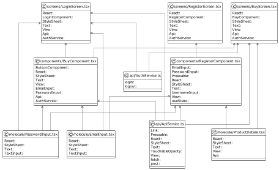

# Vierter Blogpost (KW45)

## Software Requirements Specification

Hallihallo 👋  

In Woche 4 haben wir uns intensiv mit dem Ausarbeiten von UML-Aktivitätsdiagrammen  
und der Use-Case-Realization-Specification (UCRS) des Rational Unified Process  
im Rahmen unserer Software Requirements Specification (SRS) befasst.

Das aktualisierte Dokumment wird unter dem folgenden Link bereitgestellt:
- [Software Requirements Specification](SRS/v2_w4/SoftwareRequirementsSpecification.md)

## UML-Diagramme

Im folgenden ist ein allgemeines UML-Diagramm gegeben:  

In den unterschiedlichen Use-Cases sind die Use-Case-Spezifischen UML-Diagramme zu finden.  
_(Aktuell Registreieren; Einloggen; Bezahlen)_

## Sequenzdiagramme

Teil der dieswöchigen Aufgabenstellung ist es gewesen,  
Sequenzdiagramme zu den Use-Cases hinzuzufügen.  
Diese haben wir in Mermaid definiert, sodass diese einen einheitlichen Look&Feel erhalten.
Die Diagramme sind in den folgenden Use-Cases zu finden:
 - [Konto Erstellen](./SRS/v2_w4/use_cases/UC1_Konto_Erstellen.md)
 - [Einloggen](./SRS/v2_w4/use_cases/UC2_Einloggen.md)
 - [Bezahlvorgang](./SRS/v2_w4/use_cases/UC10_Bezahlvorgang.md)

## React Native 
Im Frontend hat sich einiges entwickelt,
die ersten Views stehen bereits und wir experimentieren an allen Enden.  
Konkreteres gibt es im Laufe der nächsten Blog-Posts. :)

## Backend Tests & Minimierung
Um die Ausarbeitung des Backends so minimal wie möglich zu halten,  
hat es einen kleinen Refactor gegeben.  
Ein weiterer Aspekt der hier mit eingeflossen ist, sind Tests.
Deno stellt eine offizielle Implementierung für [Behaviour-Driven-Development](https://docs.deno.com/runtime/manual/basics/testing/behavior_driven_development) zur verfügung,  
deren API identisch zu der von Jest ist und demnach eine erhöhte Portabilität aufweist - sollten wir jemals die Laufzeit wechseln wollen.  

Der Hauptvorteil liegt jedoch eindeutig in dem Wiederverwenden bekannter Muster.

---  
Letzte Woche: [Dritter Post _(KW43)_](03_SRS_OpenAPI.md)   
Nächste Woche: [Fünfter Post _(KW46)_](05_Implementation.md)

---

