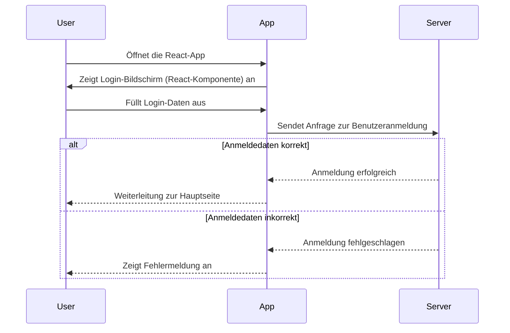
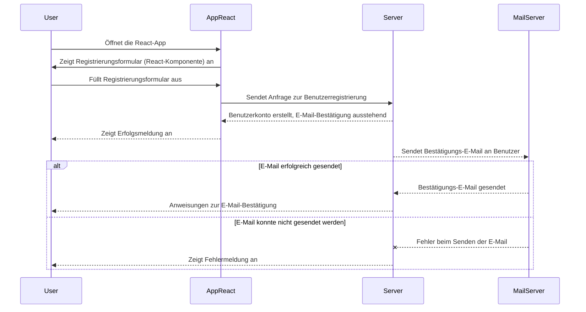
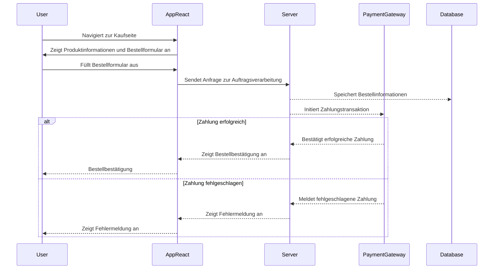

# Vierter Blogpost (KW44)

## Software Requirements Specification

Hallihallo 👋  

In Woche 4 haben wir uns intensiv mit dem Ausarbeiten von UML-Aktivitätsdiagrammen  
und der Use-Case-Realization-Specification (UCRS) des Rational Unified Process  
im Rahmen unserer Software Requirements Specification (SRS) befasst.

Auf das Dokumment können Sie mit dem folgenden Link zugreifen:
- [Software Requirements Specification](SRS/v2_w4/SoftwareRequirementsSpecification.md)

Für die Erstellung der Mocks haben wir auf das Tool namens [Miro](https://miro.com/) zurückgegriffen. Miro ist eine Online-Kollaborationsplattform, die es uns ermöglicht, Ideen zu visualisieren, Prozesse zu modellieren und Mockups zu erstellen. Es ist ein äußerst nützliches Werkzeug, um unsere Gedanken zu organisieren und die Anforderungen in einer visuell ansprechenden Weise zu präsentieren.

## Sequenzdiagramme

Teil der dieswöchigen Aufgabenstellung ist es gewesen,  
Sequenzdiagramme zu den Use-Cases hinzuzufügen.  
Diese haben wir in Mermaid definiert, sodass diese einen einheitlichen Look&Feel erhalten.

### Login-Page

### Registrierungs-Page

### Payment

---  
Letzte Woche: [Dritter Post _(KW43)_](02_SRS_OpenAPI)  
Nächste Woche: [Fünfter Post _(KW45)_](TODO)

---

