# Vierter Blogpost (KW44)

## Software Requirements Specification

Hallihallo 👋  

In Woche 4 haben wir uns intensiv mit dem Ausarbeiten von UML-Aktivitätsdiagrammen  
und der Use-Case-Realization-Specification (UCRS) des Rational Unified Process  
im Rahmen unserer Software Requirements Specification (SRS) befasst.

Auf das Dokumment können Sie mit dem folgenden Link zugreifen:
- [Software Requirements Specification](SRS/v2_w4/SoftwareRequirementsSpecification.md)

Für die Erstellung der Mocks haben wir auf das Tool namens [Miro](https://miro.com/) zurückgegriffen. Miro ist eine Online-Kollaborationsplattform, die es uns ermöglicht, Ideen zu visualisieren, Prozesse zu modellieren und Mockups zu erstellen. Es ist ein äußerst nützliches Werkzeug, um unsere Gedanken zu organisieren und die Anforderungen in einer visuell ansprechenden Weise zu präsentieren.

## Sequenzdiagramme

Teil der dieswöchigen Aufgabenstellung ist es gewesen,  
Sequenzdiagramme zu den Use-Cases hinzuzufügen.  
Diese haben wir in Mermaid definiert, sodass diese einen einheitlichen Look&Feel erhalten.

### Login-Page

```mermaid
 sequenceDiagram
  participant User
  participant App
  participant Server

  User->>App: Öffnet die React-App
  App->>User: Zeigt Login-Bildschirm (React-Komponente) an

  User->>App: Füllt Login-Daten aus
  App->>Server: Sendet Anfrage zur Benutzeranmeldung

  alt Anmeldedaten korrekt
    Server-->>App: Anmeldung erfolgreich
    App-->>User: Weiterleitung zur Hauptseite
  else Anmeldedaten inkorrekt
    Server-->>App: Anmeldung fehlgeschlagen
    App-->>User: Zeigt Fehlermeldung an
  end
```

### Registrierungs-Page

```mermaid
sequenceDiagram
  participant User
  participant AppReact
  participant Server
  participant MailServer

  User->>AppReact: Öffnet die React-App
  AppReact->>User: Zeigt Registrierungsformular (React-Komponente) an

User->>AppReact: Füllt Registrierungsformular aus
  AppReact->>Server: Sendet Anfrage zur Benutzerregistrierung

  Server-->>AppReact: Benutzerkonto erstellt, E-Mail-Bestätigung ausstehend
  AppReact-->>User: Zeigt Erfolgsmeldung an

  Server-->>MailServer: Sendet Bestätigungs-E-Mail an Benutzer
  alt E-Mail erfolgreich gesendet
    MailServer-->>Server: Bestätigungs-E-Mail gesendet
    Server-->>User: Anweisungen zur E-Mail-Bestätigung
  else E-Mail konnte nicht gesendet werden
    MailServer--x Server: Fehler beim Senden der E-Mail
    Server-->>User: Zeigt Fehlermeldung an
  end
```

### Payment

```mermaid
sequenceDiagram
  participant User
  participant AppReact
  participant Server
  participant PaymentGateway
  participant Database

  User->>AppReact: Navigiert zur Kaufseite
  AppReact->>User: Zeigt Produktinformationen und Bestellformular an

  User->>AppReact: Füllt Bestellformular aus
  AppReact->>Server: Sendet Anfrage zur Auftragsverarbeitung

  Server-->>Database: Speichert Bestellinformationen

  Server-->>PaymentGateway: Initiert Zahlungstransaktion
  alt Zahlung erfolgreich
    PaymentGateway-->>Server: Bestätigt erfolgreiche Zahlung
    Server-->>AppReact: Zeigt Bestellbestätigung an
    AppReact-->>User: Bestellbestätigung
  else Zahlung fehlgeschlagen
    PaymentGateway-->>Server: Meldet fehlgeschlagene Zahlung
    Server-->>AppReact: Zeigt Fehlermeldung an
    AppReact-->>User: Zeigt Fehlermeldung an
  end

```

---  
Letzte Woche: [Dritter Post _(KW43)_](02_SRS_OpenAPI)  
Nächste Woche: [Fünfter Post _(KW45)_](TODO)

---

