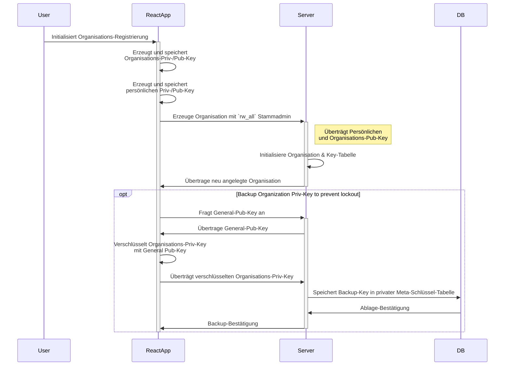
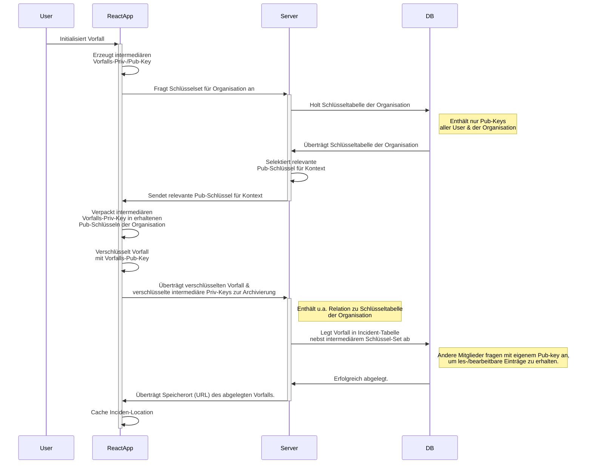
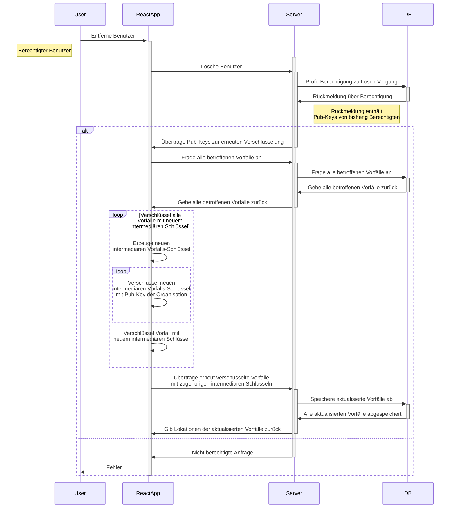

# Fünfter Blogpost (KW46)

Hallihallo 👋  

In Woche 4 haben wir uns etwas mit der eigentlichen Implementierung unseres Incident Archivs befasst.
Dabei 

Zudem haben wir unsere [Software Requirements Specification](SRS/v2_w4/SoftwareRequirementsSpecification.md) dem Feedback nach angepasst.  
Die Aufwandsschätzung in Story-Points entspricht nun der im Dokument Eingangs erwähnten Skala.  

## Backend

Das Backend hat in der letzten Woche weitere Implementierungen  
in Form von **Middlewares, Utility-Funktionen, Templates und Tests** erhalten,  
die eine reibungslose und strukturierte Weiterentwicklung begünstigen sollen.  

Die erste API-Version `v1` bleibt bislang jedoch aus,  
da zuerst das weitere Vorgehen in einer Gruppenbesprechung besprochen werden muss.  
_Ob und wie wir DSGVO-Konform weiterarbeiten werden.._

Des Weiteren hat es Entwicklungen im Bereich der API-Request-/-Response-Objekte gegeben,  
die wir mit der Zod-Notation definieren, um während der Laufzeit Schema-Validierungen zu erhalten.  
So gibt es mittlerweile für die Organisations-/ und Vorfalls-Anlage einsatzbereite Zod-Schemata,  
die nach Bedarf abgeändert werden können.

### Verschlüsselungsart

Ein weiteres ist das Thema Sicherheit.  
Wir möchten unseren Kunden eine maximal sichere Umgebung für personenbezogene  
und demnach DSGVO-Geschützte Daten anbieten.  

Hierbei setzen wir dem Plan nach auf das [Kyber-Kryptoverfahren](https://pq-crystals.org/kyber/),  
wofür es bereits Implementierungen in TypeScript gibt.  
In Kombination mit einem klassischen kryptographie Verfahren (da offiziell empfohlen) werden wir uns voraussichtlich in der nächsten Woche für eine Implementierungs-Art entscheiden.  

Bislang stehen uns drei Varianten zur Wahl,  
zumal nur zwei davon eine tatsächliche [E2EE](https://de.wikipedia.org/wiki/Ende-zu-Ende-Verschl%C3%BCsselung) ermöglichen.  

In jedem Fall wird die Basis durch eine asymmetrische Verschlüsselung abgebildet,  
da es zu Kyber-90s (symmetrisches Verfahren) bislang kein TypeScript-Modul gibt.  
_Eine alternative Lösung wäre ein Port der Implementierung des [pqc_kyber](https://crates.io/crates/pqc_kyber#features) crates, was aktuell jedoch den Rahmen sprängen würde._

### Schlüssel-Management

Hier haben wir uns beim Konzeptionieren nach dem [oWASP Key-Management Cheat-Sheet](https://cheatsheetseries.owasp.org/cheatsheets/Key_Management_Cheat_Sheet.html) gerichtet,  
um mögliche Fehler mit diesem kritischen Thema zu vermeiden.

Wenn wir uns in der Team-Abstimmung dafür entscheiten,  
sieht der zukünftige Prozess voraussichtlich folgendermaßen aus..

#### Organisations-Erstellung

Ähnlich zu einem [Schlüsselserver](https://de.wikipedia.org/wiki/Schl%C3%BCsselserver) wird voraussichtlich **für jede Organisation** eine Liste aller öffentlichen Schlüssel angelegt,  
auf die alle Mitglieder der Organisation zugreifen können,  
um die Incidents für ein jeweils anderes Mitglied der Organisation zugänglich zu machen.

Die eigentliche Anlage eines Vorfalls sieht danach wie folgt aus..

#### Incident-Erstellung

Basierend auf intermediären Schlüsseln, die mit allen berechtigten Benutzern geteilt werden (Key-Chain),  
erhält jeder Vorfall ein eigenes Schlüsselset, wobei dieses mit den Pub-Keys der Organisation(-smitglieder) auf der Client-Seite verpackt wird,  
um keine privaten Schlüssel an der API/im Backend zu bearbeiten.

Der zugehörige Ablauf wird im Fall das folgende Ablaufs-Schema abhandeln..

Beim Editieren eines Incidents kann jeder berechtigte Benutzer mit dem lokal abgespeicherten,  
privaten Schlüssel den Vorfall entschlüsseln,  
bearbeiten und mit demselben intermediären Vorfalls-Schlüssel wie beim Erstellen absichern.

#### Benutzer löschen

Hierbei muss nun ein neuer intermediärer Schlüssel angelegt werden,  
da der zu löschende Benutzer zuvor Zugriff auf den intermediären Vorfalls-Schlüssel gehabt hat.  

## Frontend

An der eigentlichen Benutzerschnittstelle hat es Fortschritte im Bereich des Routing gegeben  
und erste Screens stehen bereits zur Verfügung..

### Was ist Incid-Arch? - Screen

### Login: Home - Screen

## Aktuelle Hürden

Neben der eigentlichen Erstellung von Atomen > Molekülen > Organismen > Templates > Pages (nach dem Atomic-Schema) im Frontend,  
stellt sich aktuell vor allem die Herausforderung von Authentifizierten-Routen.  
Hier gibt es bislang keine einfache Lösung, wir bleiben allerdings dran hier weiterzumachen..

Im Backend stellt vor allem die Unklarheit über die Ziel-Infrastruktur einen Blocker dar,  
zumal es dennoch möglich ist an anderen Stellen, wie der Resilienz des Service oder einer verbesserten Entwickler-Erfahrung weiterzuarbeiten.  

Es bleibt spannend wie die kommenden Wochen den Kurs des Projekts beeinflussen werden,  
in jedem Fall geht es voran und das ist doch nie etwas schlechtes. :D

---  
Letzte Woche: [Vierter Post _(KW45)_](04_UML_n_UCRS.md)   
Nächste Woche: [Sechster Post _(KW47)_]()

---


