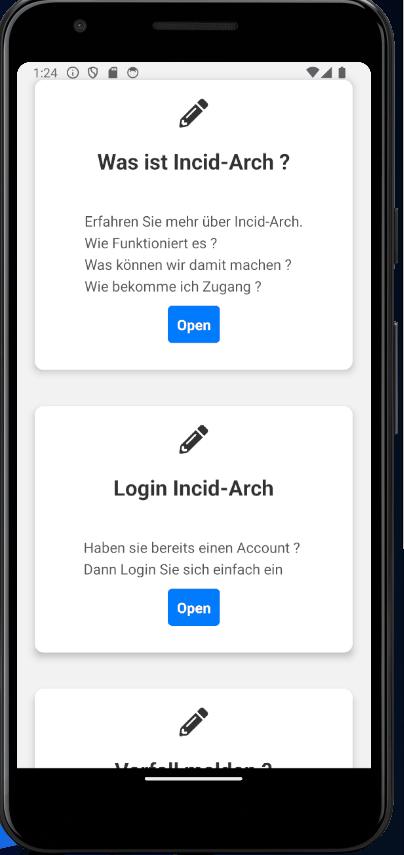
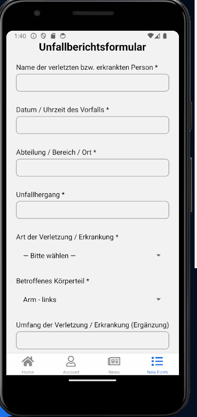
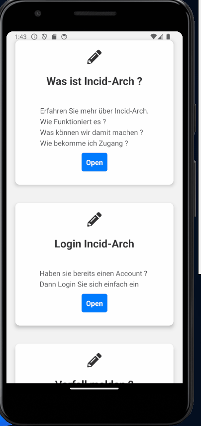

# Sechster Blogpost (KW47)

Heyho 👋  

In Woche 6 haben wir uns versiert mit der eigentlichen Implementierung unseres Incident Archivs befasst.

# Frontend
## AboutScreen
Unten kannst du einen exklusiven Blick auf die erste Testversion unserer About-Seite werfen. Als GIF eingefangen, bietet es einen flüchtigen, aber aufregenden Einblick in das, woran wir arbeiten. Schau es dir an und lass uns wissen, was du denkst!

## Unfallbericht

Schau mal in das nächste GIF! Dort kannst du sehen, wie mühelos ein Unfallbericht erstellt werden kann. Wir haben etwas an Details gefeilt, um den Prozess so benutzerfreundlich wie möglich zu gestalten. 

## Login + Dashboard
Last but not least, im finalen GIF siehst du Theoretisch wie man sich einloggt und Zugang zu unserem exklusiven Bereich zu erhalten. 

## Backend
Die API nimmt langsam, aber sicher Form an.  
Allerdings haben wir bislang keine persistenten Daten in einer Datenbank liegen,  
weshalb bislang nur loopbacks und Platzhalter zurückgegeben werden.  

Die Implementierungsweise der Datenbank-Anbuindung steht allerdings schon fest.  
Nachdem wir verschiedene Datenbank-Adapter ausprobiert haben (denoDB/Keysely/Drizzle/Prisma),  
haben wir uns für Prisma entschieden, da dieses ORM am ausgereiften ist.  
In Kombination mit einer kostenlos gehosteten PostgreSQL-Datenbank auf Superbase,  
sind wir aktuell dabei die Anbindung abzuschließen.  

Auf der Deno-Plattform benötigt Prisma den "Prisma Data Proxy",  
der zugleich auch als Connection-Pooler fungiert.  
Diesen werden wir via Docker entsprechend selbst bereitstellen:  
https://github.com/aiji42/prisma-data-proxy-alt.

Glücklicherweise steht unser initiales Schema bereits bereit  
und nachdem die Anbindung abgeschlossen ist,   
können wir direkt mit der Geschäftslogik starten.

### Aktuelle Hürden

Große Hürden bleiben zum Glück aus,  
dennoch treten gelegentlich kleinere Hürden,  
wie aktuell ein Fehler in der Auswertung der HTTP-Header  
für alle authentifizierten Ressourcen.
Der Deno-Debugger erspart uns hier jedoch mühevolle Stunden.

## Für nächste Woche

Ziel für die nächste Woche ist es nachdem die Persistierung im Backend zur Verfügung steht,  
die Anbindung an das Frontend für `v1` abzuschließen,  
hier ist bislang nur der OpenAPI-Client plaziert,  
um die TypeScript-Typen richtig zu transportieren  
und die Entwickler-Erfahrung zu verbessern  
und Bugs zu minimieren.  

---  
Letzte Woche: [Fünfter Post _(KW46)_](05_Implementation.md)
Nächste Woche: [Siebter Post _(KW48)_]()

---


