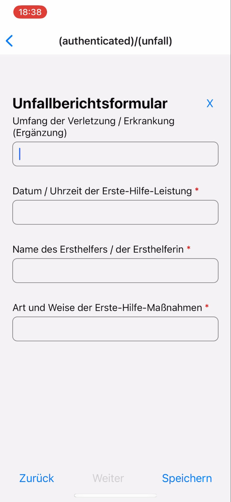
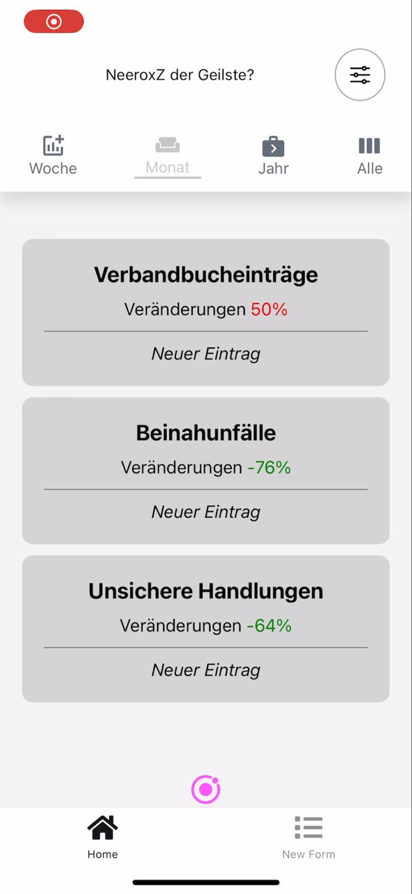

# Clean Code 🧹

Aufräumen muss (leider :) manchmal sein,  
so auch in Software-Projekten und in der Folge bei IncidArch.  

Als Standard-Leitfaden haben wir das in React (-Native) gängige Atomic-Schema angewendet,  
um unsere Komponenten-Bauweise strukturiert anzugehen.

](../images/atomic-schema.webp)

Dem Atomic-Schema nach ist unsere lebendige App-Struktur in dem `/app/` Verzeichnis abgelegt,  
die zudem auf jeder App-Ebene, abgebildet durch die Verzeichnis-Hierachie, eine `_layout.tsx`-Datei enthält.  
In dieser werden die unterschiedlichen Pages und deren Header zusammengeführt,
die für die aktuelle App-Ebene relevant sind.

Die eigentlichen Ansichten (Pages) werden in jeweils eigene Dateien ausgelagert (`form.tsx`, `home.tsx`, `profile.tsx`, etc.) und enthalten die Page.  
In (fast) allen Fällen ist das zugehörige Template in das `/src/screens/`-Verzeichnis ausgelagert,  
um die Hydration der konkreten Benutzer-Daten von dem unterliegenden App-Aufbau zu trennen.  

Die kompositionierten Komponenten der Screens (Templates) werden größtenteils in das `/src/components` ausgelagert.  

Die eigentlichen Benutzer-Daten werden über `/src/stores/`
mit dem Supabase-Client aus der PostgresSQL-Datenbank abgerufen und eingelagert (WiP).  
Werden diese an irgendeiner Stelle in der App benötigt,  
kann der Store ganz einfach importiert und verwendet werden.

## Prettier & ESLint

Für eine einheitliche Formattierung und ein stabiles Linting greifen wir auf die Industrie-Standards [Prettier](https://prettier.io/) und [ESLint](https://eslint.org/) zurück,  
wobei wir dem KISS-Prinzip nach die Standard-Einstellungen bewahrt haben und bspw. nicht die AirBnB-/ oder Google-Formatierung konfiguriert haben.   

## Refactoring des Source Codes

Bei unserem letzten Refactoring haben wir uns ausschließlich auf die Verbesserung der Benutzeroberfläche (UI) konzentriert. Durch diese Anpassungen streben wir an, die Benutzerfreundlichkeit zu erhöhen und eine intuitivere Erfassung sowie Navigation zu ermöglichen.

### Neues Unfallberichtsformular:

Das Bild zeigt das aktualisierte UI für das Eintragen eines neuen Unfallberichtsformulars. Durch die Überarbeitung der Formularstruktur ermöglichen wir nun eine benutzerfreundliche Klickstrecke zur Erfassung relevanter Informationen. Nach dem Ausfüllen kann das Formular einfach gespeichert werden.

### Dashboard mit Übersicht von Einträgen:

Hier präsentieren wir das überarbeitete Dashboard mit einer übersichtlichen Darstellung aller Einträge. Die Optimierung des Layouts ermöglicht eine effizientere Navigation und Analyse von Unfalldaten.  

---  
Letzte Woche: [RMMM Tabelle und Fortschritt _(KW16/24)_](12_Risiko-und-Fortschritt.md)  
Nächste Woche: [Upcoming]()  
---


