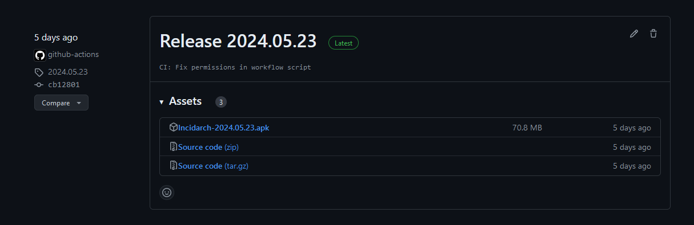

# Neue Woche: Fortschritte und Optimierungen

## Zusammenfassung der Änderungen

In der letzten Woche haben wir einige bedeutende Verbesserungen an unseren Workflows und der Codebasis vorgenommen. Hier ein kurzer Überblick über die wichtigsten Änderungen:

### CI/CD Workflow

Wir haben einen neuen Workflow für den EAS-Build und die Release-Erstellung eingeführt. Dieser Workflow automatisiert den gesamten Prozess von der Installation der Abhängigkeiten über den Build bis hin zum Release-Upload unserer Android-App. 

Der Workflow läuft auf einem Ubuntu-Server und umfasst die folgenden Schritte:
- **Checkout des Codes**: Der Quellcode wird aus dem Repository ausgecheckt.
- **Setup der Node- und Expo-Umgebung**: Die erforderlichen Versionen von Node.js und Expo werden eingerichtet.
- **Installation der Abhängigkeiten**: Alle notwendigen npm-Abhängigkeiten werden installiert.
- **Build auf EAS**: Die App wird mit EAS (Expo Application Services) für die Android-Plattform gebaut.
- **Erstellung eines GitHub-Releases**: Die erstellte APK-Datei wird in einem neuen GitHub-Release hochgeladen.

---

Letzte Woche: [Metriken & Clean Code Ergänzungen](16_Metriken.md)

Nächste Woche: [Upcoming]()

---


