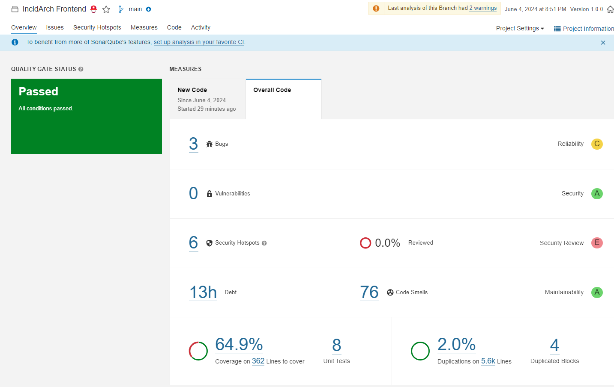

# Review & Code-Analyse

## Review 👀

Uns ist es leider nicht möglich gewesen ein Review-Gespräch zu organisieren,
stattdessen haben wir textuell eine offene Fragerunde auf Discord gestartet,
wo unter anderem Interessant gewesen ist:

 1. Ist allen klar welche Komponenten & Dateien welche Funktion einnehmen?
 2. Ist das Vorgehen nach SOLID in React klar?
 3. Ist die beiläufige, technische Dokumentation in READMEs & Kommentaren ausreichend?
 4. Ist unser Code wartbar? *Folgen wir (strikt) der definierten Atomic-Architektur?*
 5. Erfüllt der Code die nicht-funktionalen Anforderungen?
 6. Was kann man im Projektmanagement wie besser machen?

Das Ergebnis, also die individuellen Antworten auf diese Frage fassen sich wie folgt zusammen:

###  1. Ist allen klar welche Komponenten & Dateien welche Funktion einnehmen?

Es ist ein Fakt, dass mehrere Verzeichnisse in unserem Repository existieren.  
Diese Verzeichnisse enthalten verschiedene .ts-Dateien und diese eine und mehr Funktionen.  
Der letzte Punkt über 1:n Relation auf mehrere Funktionen in einer Datei ist als Verbesserungsvorschlag hervorgegangen, dass eine .ts-Datei möglichst wenig unabhängige Funktionen enthalten soll. Dieser Vorschlag wird durch das Single Responsibility Prinzip gestützt.

###   2. Ist das Vorgehen nach SOLID in React klar?

Die SOLID-Prinzipien sind allen soweit bekannt und der Bezug auf React (Native)
ist klargestellt. Genaue Implementierungsweisen sind teilweise unklar, 
was nicht zuletzt React selbst geschuldet ist, 
wonach Hooks nur in einem bestimmten (React-)Kontext verwendet werden dürfen.  
Dennoch sind besonders die Single Responsibility und Dependency Inversion allseits angewandte Best-Practices.

###  3. Ist die beiläufige, technische Dokumentation in READMEs & Kommentaren ausreichend?

Gute Dokumentation lebt und im Fokus der Problemlösung & Feature-Implementierung rückt die Dokumentation gerne in den Hintergrund. `README.md`-Dateien existieren in manchen Verzeichnissen, sind jedoch häufig einmalige Produktionen. Hier ist es wünschenswert die Dokumentation soweit zu beleben, dass diese mit dem Projektfortschritt mithalten. 

### 4. Ist unser Code wartbar?

Die Antwort im Team ist >>ja<<, unser Code ist wartbar,
da wir uns auf allgemeine, wie spezielle Best-Practices stützen.
Diese Aussage gilt universell für unser React-Native Front-End, sowie unser Backend mit seinen Edge-Functions und PostgreSQL.

Hinsichtlich der Einhaltung der definierten Atomic-Architektur im Front-End müssen wir jedoch einräumen, dass wir aufgrund des Zeitdrucks gegen Ende des Projekts dieseOrdnung etwas vernachlässigt haben und viele Komponenten in einer Datei getestet und geschrieben worden und später nicht aufgeteilt worden sind. Hier steht uns in Zukunft ein Refactor bevor, um eine striktere Einhaltung der Architekturprinzipien sicherzustellen
und um unsere Code-Duplikations-Metrik im Sinne einer besseren Wartbarkeit gering zu halten.

###  5. Erfüllt der Code die nicht-funktionalen Anforderungen?

Im Bereich der nicht-funktionalen Abhängigkeiten sind wir in der Umsetzung vor allem an der Front der Sicherheit gut gerüstet. Infrastrukturell ist das Backend ausschließlich über HTTPS erreichbar, wobei alle Datenbankzugriffe über restriktive (manuell) getestete RLS-Policies auf den aktuellen Benutzer und dessen CRUD-Freigabe beschränkt werden.
Infolge der Entscheidung zu Beginn des 4. Semesters, das Projekt-Ziel auf das Front-End zu fixieren und das Backend zu vereinfachen, können wir mit der Umstellung auf Supabase zugleich auf einen eigenen Controller verzichten.
Etwaige Geschäftslogik, wie die Organisations-Initialisierung werden über TypeScript-Edge-Functions abgebildet. 
Durch die Verwendung von Deno und dem Vorkompilieren von TS-Code reagieren die Endpunkte selbst bei einem Kaltstart ohne überflüssige Verzögerungen.

###  6. Was kann man im Projektmanagement wie besser machen?

Ein Hauptproblem war die mangelnde Erfahrung im Bereich der Projektbeschreibung und Zielsetzung für ein komplett neues Projekt in diesem Umfang. Wir haben uns zu viele Funktionen für die Version 1.0 vorgenommen. Ein besserer Ansatz wäre gewesen, sich von Anfang an auf die Grundkonzepte zu konzentrieren und zusätzliche Features für spätere Versionen zu planen. Durch eine Fokussierung auf die Basisfunktionalitäten hätte das Projekt wahrscheinlich innerhalb des vorgesehenen Zeitrahmens abgeschlossen werden können.

Diese Fehleinschätzung führte dazu, dass wir zu Beginn des vierten Semesters das aktuelle Projekt zu 80 % verwerfen mussten und noch einmal von vorn anfangen mussten. Dies hat uns wertvolle Zeit und Ressourcen gekostet.

Genauso müssen wir Krankheitsausfällen Berücksichtigung schenken.  
Diese unvorhergesehenen Ausfälle haben gelegentlich zu zeitlichen Problemen geführt.  

In Zukunft sollten wir Pufferzeiten in unseren Zeitplänen einplanen  
und eventuell Vertretungsregelungen festlegen, um solche Engpässe besser abzufangen.  
Das kann die Resilienz des Teams erhöhen und sicherstellen,  
dass der Projektfortschritt nicht durch einzelne Ausfälle gefährdet wird. 
 
Des Weiteren sind regelmäßige Meetings und eine offene Kommunikationskultur förderlich,  
um alle Teammitglieder auf dem gleichen Stand zu halten und Missverständnisse zu vermeiden.   

Obwohl bereits ein Kanban-Board verwendet wird, kann die Implementierung zusätzlicher,  agiler Praktiken (scrum ceremonies) die Effizienz und Flexibilität des Teams weiter steigern.  

Insbesondere sollten ausführliche und verpflichtende Sprint-Planungen und regelmäßige Jour-Fixe eingeführt werden.

Aus der Projektmanagement-Sicht haben wir zusammengefasst gefolgert,  
dass die folgenden Punkte höher priorisiert werden müssen:
 - Arbeitspakete sind bestmöglich auf atomare Teile/ Sub-Issues herunterzubrechen.
 - Planung & Organisation, bestmöglich durch eine oder wenige Personen im Kern.
 - Planende Personen sollten Aufgaben atomar als Feature/Bug-Fix bereitstellen.
 - verpflichtende jour-fixe (gerne auch zu flexiblen, klar kommunizierten Zeiten).
 - Mehr Rücksicht auf individuelle Verhaltensweisen & frühzeitige Unterstützung.

## Code-Analyse mit SonarQube 🪼

Besser spät als nie, nun zum 18. Blogbeitrag hier die Ergebnisse unserer ersten statischen Code-Analyse mit SonarQube
und dem SonarScanner:

Grob zusammengefasst sagt der Score aus,
dass unsere Code-Qualität einen akzeptablen Zustand erreicht hat.
Zwei der angegebenen "Security-Hotspots" entstehen aus einer Test-Datei zu der `RegisterComponent.ts`,
da diese bei Beginn in die Auswertung gerutscht ist, weshalb SonarQube hier fälschlicherweise zwei High priority `potentially hardcoded credential` angibt.

Eine weitere tritt in der `HomeScreen.tsx` Datei auf, wo wir bis dato
noch Zufallszahlen als Statistik-Werte verwenden,
wobei SonarCube diese mit einem `pseudorandom number` Fehler unter Medium priority versieht.

Der einzig ernst zu nehmende Security-Hotspot mit low priority scheinen somit
die Wildcard-CORS Angabe der Backend-Funktionen, sowie die Auto-Generierten Berechtigungs-Anfragen von Expo im Android-Kontext zu sein,
bei letzterem werden Berechtigungen für `WRITE_EXTERNAL_STORAGE` und `RECORD_AUDIO` angefragt,
zumal wir maximal für ersteres im Storage-Kontext einen nutzen haben.

Die Code-Smells bewegen sich größtenteils im Minor-Bereich,
dennoch haben wir 8 kritische Code Smells, wobei fünf auf noch nicht implementierte,
aber deklarierte Funktionen zurückzuführen sind,
sowie zwei durchzuführende Refactors zwecks zu hoher Komplexität der Funktionen
und eine bezüglich eines Duplikats in einer TS-Typendeklaration,
die wohl durch den Linter nicht dedupliziert worden ist.

Da diese Probleme für uns vorerst keine Priorität haben und diese unsere Demo nicht weiter einschränken oder im Endeffekt unsicherer machen, ist es dennoch gut über deren Existenz informiert zu sein,
um in Zukunft mögliche Maßnahmen treffen zu können.

---

Letzte Woche: [Neue Woche: Fortschritte und Optimierungen](17-CI-CD-Pipeline.md)

Nächste Woche: [Upcoming]()

---


