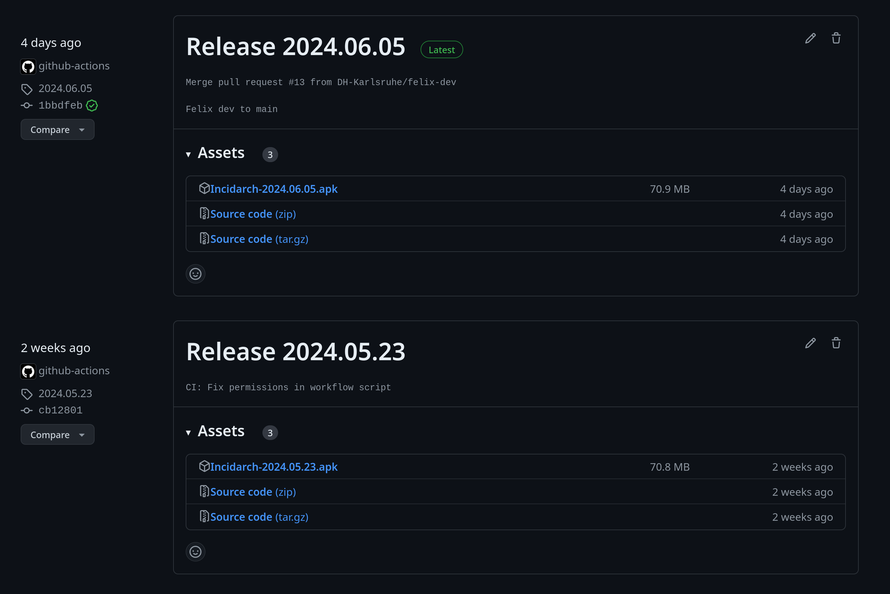

# IncidArch
Befreien Sie sich von der Last handschriftlich ausgefüllter Unfallberichte und dem Chaos von Papierstapeln mit schwer entzifferbaren Vorfällen. Digitale Unfallprotokolle sind nicht nur auf dem Vormarsch – sie sind bereits hier und erleichtern Ihren Alltag erheblich. Erfüllen Sie Ihre Dokumentationspflicht nach DGUV § 24 Abs. 6 einfach, sicher und digital. Alle Daten werden nach DSGVO ausschließlich in Europa verarbeitet und gespeichert. Schluss mit dem lästigen Papierkram und herzlich willkommen zu einer effizienteren, modernen und rechtlich konformen Lösung.

## Vorstellung des Teams
| Name        | Rolle                       |
|-------------|-----------------------------|
| Felix       | Backend-Entwickler          |
| Alexander   | Frontend-Entwickler         |
| Cristiano   | Frontend-Entwickler         |
| Nick        | Full-Stack-Softwareentwickler|

## Aufwandsstatistiken

### Statistiken über die Aufwändungen Semester 1

| Person           | Hauptbeitrag         | Stunden |
|------------------|----------------------|---------|
| Felix Blank      | Backend-Entwicklung  | 44      |
| Nick Obreiter    | Frontend-Entwicklung | 43      |
| Alexander Geier  | Projektmanagement    | 30      |
| Cristiano Gomes  | Qualitätssicherung   | 25      |

#### Stunden pro Workflow

| Workflow            | Stunden |
|---------------------|---------|
| Requirement Analyse | 15      |
| Project Management  | 20      |
| Frontend-Entwicklung| 40      |
| Backend-Entwicklung | 30      |
| Testing/QA          | 15      |

#### Stunden pro Phase

| Phase       | Stunden |
|-------------|---------|
| Planung     | 30      |
| Umsetzung   | 60      |
| Testing     | 10      |
| Dokumentation| 20      |

### Statistiken über die Aufwändungen Semester 2

| Person           | Hauptbeitrag                              | Stunden |
|------------------|-------------------------------------------|---------|
| Felix Blank      | Backend-Entwicklung & Projektmanagement   | 70      |
| Nick Obreiter    | Frontend-Entwicklung                      | 72      |
| Alexander Geier  | Projektmanagement & Qualitätssicherung    | 30      |
| Cristiano Gomes  | Frontend & Building                       | 28      |

#### Stunden pro Workflow

| Workflow            | Stunden |
|---------------------|---------|
| Requirement Analyse | 10      |
| Project Management  | 15      |
| Frontend-Entwicklung| 80      |
| Backend-Entwicklung | 40      |
| Testing/QA          | 35      |
| Building/Deployment | 20      |

#### Stunden pro Phase

| Phase       | Stunden |
|-------------|---------|
| Planung     | 20      |
| Umsetzung   | 100     |
| Testing     | 30      |
| Dokumentation| 25      |

### Kombinierte Statistiken über beide Semester

#### Gesamtstunden pro Person

| Person           | Gesamtstunden |
|------------------|---------------|
| Felix Blank      | 114           |
| Nick Obreiter    | 115           |
| Alexander Geier  | 60            |
| Cristiano Gomes  | 53            |

#### Gesamtstunden pro Workflow

| Workflow            | Stunden |
|---------------------|---------|
| Requirement Analyse | 25      |
| Project Management  | 35      |
| Frontend-Entwicklung| 120     |
| Backend-Entwicklung | 70      |
| Testing/QA          | 50      |
| Building/Deployment | 20      |

#### Gesamtstunden pro Phase

| Phase       | Stunden |
|-------------|---------|
| Planung     | 50      |
| Umsetzung   | 160     |
| Testing     | 40      |
| Dokumentation| 45      |

**Info Box:**
Die Frontend-Entwicklung steht im Fokus unserer Arbeit, da das Frontend zu Beginn des 4. Semesters vollständig neu gestaltet wurde. Fast alle bisherigen Entwicklungen aus dem 3. Semester wurden verworfen. Der Hauptgrund dafür war, das Benutzerinterface an aktuelle Standards anzupassen, eine Erkenntnis, die während der Praxisphase gewonnen wurde. Zudem war ein Versionssprung von Expo SDK 49 auf SDK 51 erforderlich, um die Kompatibilität mit der Expo-Go-App aufrechtzuerhalten. Dieser Schritt war unvermeidlich, um die Funktionalität und Nutzung der App weiterhin sicherzustellen.
**

### Felix Blank:
Felix Blank spielte eine zentrale Rolle im Projekt. Er war verantwortlich für die Planung und Umsetzung der Datenbankarchitektur. Seine Expertise in der Backend-Entwicklung ermöglichte die reibungslose Implementierung der Kernfunktionalitäten. Darüber hinaus hat er aktiv am Projektblog teilgenommen, indem er regelmäßig Beiträge verfasst hat, um den Fortschritt und die Erfolge des Teams zu dokumentieren.

### Nick Obreiter:
Nick Obreiter zeichnete sich durch sein herausragendes Design- und Entwicklungsverständnis aus. Er war maßgeblich an der Gestaltung und Implementierung des Frontends beteiligt, wodurch eine intuitive und ansprechende Benutzeroberfläche geschaffen wurde. Neben seiner technischen Expertise hat Nick auch einen wertvollen Beitrag zum Projektblog geleistet, indem er seine Erfahrungen und Erkenntnisse mit anderen geteilt hat.

### Cristiano Gomes:
Cristiano Gomes brachte vielseitige Fähigkeiten und Engagement für das Projekt ein. Er unterstützte aktiv beim Frontend und half bei der Durchführung von Builds und Deployment-Prozessen. Seine Flexibilität und Bereitschaft, sich in verschiedene Aufgabenbereiche einzuarbeiten, haben wesentlich zum reibungslosen Ablauf des Projekts bei getragen. Zusätzlich zu seinen technischen Aufgaben trug Cristiano auch regelmäßig zum Projektblog bei, indem er seine Gedanken und Erfahrungen reflektierte.

### Alexander Geier:
Alexander Geier spielte eine wichtige Rolle bei der Sicherstellung der Qualität und Funktionalität des Projekts. Als zuständiger Tester führte er umfangreiche Tests durch, um Fehler zu identifizieren und sicherzustellen, dass die Anwendung den Anforderungen entspricht. Darüber hinaus war Alexander auch für das Sprintmanagement verantwortlich, was die effektive Planung und Koordination der Arbeitsabläufe ermöglichte. 

# Highlights der Demo_v2

## 1. Startseite der App

Beim Öffnen der App landet man, sofern man nicht eingeloggt ist, auf der Startseite. Diese wurde sorgfältig gestaltet, um einen ansprechenden ersten Eindruck zu vermitteln. Im Zentrum steht ein animiertes Unfallvideo, das die Aufmerksamkeit des Benutzers sofort auf sich zieht. Das Video veranschaulicht auf eindrucksvolle Weise die Bedeutung der App und ihre Funktionen.

Darunter befinden sich klare Call-to-Action-Buttons, die den Benutzer entweder zum Login-Bildschirm führen oder weitere Informationen über das Produkt anzeigen lassen. Der Login-Button ist prominent platziert, um Benutzer schnell und einfach zum Anmeldeprozess zu führen. Gleichzeitig bietet die Option, weitere Informationen anzuzeigen, einen Einblick in die Funktionalitäten und den Mehrwert der App, bevor sich der Benutzer entscheidet, sich einzuloggen.

Die Startseite ist modern und benutzerfreundlich gestaltet, um einen positiven ersten Eindruck zu vermitteln und die Benutzerinteraktion zu fördern.

## 2. Login und Registration

Das Login und die Registrierung sind besonders benutzerfreundlich gestaltet. Anstatt auf eine neue Seite umgeleitet zu werden, öffnet sich ein Popup bzw. Modal, das minimalistisch gestaltet ist. Dieses Design verbessert die Benutzererfahrung, da der Benutzer auf derselben Seite bleibt und nicht zwischen verschiedenen Seiten navigieren muss.

Besonders auf dem iPhone ist es möglich, das Passwort zu speichern und später mit Face ID auszufüllen. Diese Funktion verbessert die Benutzerfreundlichkeit und beschleunigt den Anmeldeprozess erheblich.

## 3. Infoseite

Die Infoseite bietet den Benutzern die Möglichkeit, alle relevanten Informationen zur App anzuzeigen. Diese Informationen werden dynamisch aus der Datenbank geladen, was sicherstellt, dass Benutzer stets auf dem neuesten Stand sind. Durch diese Implementierung können Daten hinzugefügt oder geändert werden, ohne dass der Benutzer ein Update der App durchführen muss.

Die Infoseite ist benutzerfreundlich gestaltet und bietet einen zentralen Ort für alle relevanten Informationen und Kaufmöglichkeiten.

## 4. Userdashboard

Das Userdashboard bietet Benutzern einen Überblick über die Entwicklung ihrer angelegten Unfallberichte. Es werden drei Kategorien aufgelistet, und der Benutzer kann in Prozent sehen, wie viele Berichte in jedem Zeitbereich hinzugekommen sind. Zudem gibt es eine Auswahl an Zeitbereichen, um verschiedene Datenperioden zu betrachten.

Auf der Dashboard-Seite können auch Informationen über den Benutzer angezeigt werden. Dafür gibt es eine Headerleiste, auf der Benutzer wie in modernen Apps klicken können, um auf ihre persönlichen Informationen zuzugreifen.

## 5. Benutzeransicht

Die Benutzeransicht ist extrem schön und modern gestaltet. Allerdings fehlen hier noch einige Funktionen, die implementiert werden müssen. Trotzdem bietet sie bereits einen ästhetisch ansprechenden Überblick über die wichtigsten Informationen des Benutzers.

## 6. Eintrag anlegen

Hier bieten wir dem Benutzer die Möglichkeit, seine Informationen in einer Klickstrecke anzugeben. Zuerst hat der Benutzer die Möglichkeit, mehrere Arten von Unfalltypen anzugeben. Anschließend kann er die relevanten Informationen eingeben.

Dieser Bereich muss jedoch noch designtechnisch überarbeitet werden, um die Benutzererfahrung zu verbessern und sicherzustellen, dass sie intuitiv und benutzerfreundlich ist.

# Architektur
Die Architektur von IncidArch folgt dem ATOMIC Muster. 
Das Backend wird mit Supabase betrieben, das Frontend ist mit React Native und Expo entwickelt.

## Software Tools/Plattform/Technik/Libaries
- **Sprache:** TypeScript
- **Frontend:** React Native, Expo
- **Backend:** Supabase
- **CI/CD:** GitHub Actions, Expo
- **Development & PM:** GitHub, Jira
 

### Sprache:
Die Hauptprogrammiersprache des Projekts ist TypeScript, die eine statisch typisierte Version von JavaScript ist. Die Verwendung von TypeScript ermöglicht eine verbesserte Codequalität und Entwicklerproduktivität.
- TypeScript
82.6%
 
- PLpgSQL
9.8%
 
- JavaScript
4.9%
 
- Kotlin
2.0%
 
- Shell
0.7%

### Frontend:
Für das Frontend wird React Native in Verbindung mit Expo verwendet. React Native ermöglicht die Entwicklung von plattformübergreifenden mobilen Anwendungen mit JavaScript und React, während Expo zusätzliche Funktionen und Tools bereitstellt, um den Entwicklungsprozess zu erleichtern.

Teil 1:

Teil 2:

Gesamt:

### Libraries:
Das Projekt umfasst über 40 Bibliotheken, die eine Vielzahl von Funktionen und Features unterstützen. Viele dieser Bibliotheken sind spezifisch für Expo und bieten Funktionen wie Routing, State Management und UI-Komponenten. Die Einarbeitung in diese Bibliotheken erfordert Zeit, zahlt sich jedoch am Ende aus, da sie die Entwicklung beschleunigen und die Codeorganisation verbessern.

### Backend

Anfangs wurde das Backend des Projekts auf DENO aufgebaut. Aufgrund der umfangreichen Eigenentwicklung für React Native mussten wir jedoch diese Entscheidung zu Beginn des 4. Semesters verwerfen, was leider zu einem erheblichen Zeitverlust führte.

Zu Beginn des 4. Semesters haben wir uns entschieden, auf Supabase umzusteigen, was sich als erfolgreiche Entscheidung erwies. Die Migration auf Supabase verlief reibungslos und ermöglichte es uns, schnell wieder auf Kurs zu kommen.

Allerdings wurden aufgrund des Zeitverlustes noch nicht alle Funktionen implementiert. Aktuell können nur Daten aus dem Info-Bereich abgerufen werden und die Benutzeranmeldung funktioniert.

Bild des DB-Design

## Testing
Für das Testing in unserem Projekt haben wir Jest als primäres Testing-Framework verwendet. Jest bietet eine einfache Einrichtung, schnelle Ausführung und leistungsstarke Mocking-Funktionen, die es zu einer idealen Wahl für die Entwicklung mit React Native machen.

Ein wesentlicher Bestandteil unserer Teststrategie war das Mocking, um externe Abhängigkeiten und Module zu isolieren. Hierbei kamen sowohl manuelle Mocks als auch automatisches Mocking mit jest.mock zum Einsatz, um das Verhalten von Modulen während der Tests zu steuern und eine kontrollierte Testumgebung zu schaffen.

Da Expo, ein Framework für die Entwicklung von React Native Apps, zusätzliche Herausforderungen für das Testing mit sich brachte, haben wir Expo-Module und APIs, die für unsere Unit-Tests nicht kritisch waren, gemockt. Für Komponenten, die stark von Expo abhängen, wurden die Tests entweder übersprungen oder es wurde auf Integrationstests gesetzt.

Durch die Verwendung von Jest und den strategischen Umgang mit Expo-spezifischen Herausforderungen konnten wir letztlich eine zuverlässige Testumgebung schaffen, die eine kontinuierliche Entwicklung und hohe Codequalität in unserem React Native Projekt gewährleistet.

## Metriken
Um die Testabdeckung zu messen, haben wir `jest --coverage` verwendet. Diese Option generiert einen detaillierten Bericht, der zeigt, wie viel des Codes durch Tests abgedeckt ist. Die Abdeckung umfasst Metriken wie Statements, Branches, Functions und Lines. Ein hoher Abdeckungsgrad ist ein Indikator dafür, dass der Großteil des Codes getestet wurde, was zur Stabilität und Zuverlässigkeit des Projekts beiträgt.

Übersicht der generierten Abdeckungsmetrik:

Zusätzlich zu Jest haben wir SonarQube verwendet, um die Codequalität weiter zu überwachen und zu verbessern. SonarQube bietet umfassende Einblicke in Code-Smells, Bugs und Sicherheitslücken, die während der Entwicklung eingeführt werden könnten. Es hilft uns, die Codequalität zu verbessern und sicherzustellen, dass unser Code den besten Praktiken entspricht.

## CI/CD

Für die Implementierung der Continuous Integration (CI) und Continuous Deployment (CD) verwenden wir GitHub Actions in Kombination mit Expo Application Service (EAS).

**Expo Application Service (EAS)** ist ein Set von Cloud-basierten Services, die es uns ermöglichen, unsere Expo-Anwendungen zu bauen, zu aktualisieren und zu veröffentlichen. Es bietet eine einfache Möglichkeit, Builds zu verwalten und über verschiedene Plattformen hinweg konsistent zu bleiben.

**GitHub Actions** ist ein Automatisierungsservice von GitHub, der es uns erlaubt, Workflows direkt in unseren GitHub-Repositories zu erstellen. Es ermöglicht uns, CI/CD-Pipelines zu definieren, um den Entwicklungs- und Veröffentlichungsprozess zu automatisieren.

### Continuous Integration (CI)

Unser CI-Prozess stellt sicher, dass unser Code kontinuierlich integriert und getestet wird. Dies hilft uns, Fehler frühzeitig zu erkennen und die Qualität des Codes zu gewährleisten. Unser CI-Workflow umfasst die folgenden Schritte:

1. **Code-Checkout**: Der Code wird aus unserem GitHub-Repository ausgecheckt.
2. **Node.js und Abhängigkeiten installieren**: Installation der notwendigen Abhängigkeiten.
3. **Expo-Setup**: Einrichtung von Expo und EAS.
4. **Build-Prozess**: Bau der App mit `eas build`.
5. **Release-Erstellung**: Erstellung eines Releases auf GitHub und Hochladen des APK.

### Continuous Deployment (CD)

Unser CD-Prozess stellt sicher, dass jede erfolgreiche Änderung automatisch in die Produktionsumgebung integriert wird. Unser CD-Workflow umfasst folgende Schritte:

1. **Erstellen eines GitHub-Releases**: Ein neuer Release wird auf GitHub erstellt, sobald der Build erfolgreich ist.
2. **Automatisiertes Deployment**: Das Deployment erfolgt automatisch auf den gewünschten Plattformen unter Verwendung der neuesten Build-Artefakte.

### Übersicht der Workflows

#### Übersicht aller abgelaufenen Workflows

In der Übersicht der abgelaufenen Workflows können wir alle bisherigen Runs unserer CI/CD-Pipeline sehen. Dies hilft uns, den Verlauf und den Status aller bisherigen Builds zu überwachen.

#### Zusammenfassung eines bestimmten Runs

Die Zusammenfassung eines bestimmten Runs zeigt uns detaillierte Informationen über den Ablauf und das Ergebnis dieses Runs. Hier können wir sehen, welche Schritte erfolgreich waren und wo eventuell Fehler aufgetreten sind.

### Release-Seite

Auf der Release-Seite werden alle Artefakte aufgelistet, die von unserem CI/CD-Prozess gebaut wurden. Hier können wir die verschiedenen Versionen unserer Anwendung einsehen und herunterladen.

## Highlights
Wir sind besonders stolz auf unsere robuste Authentifizierungs- und Autorisierungslogik, die auf JSON Web Tokens (JWT) basiert und in Kombination mit Supabase und React Native verwendet wird. Die Integration von JWT ermöglicht eine sichere und effiziente Authentifizierung und Autorisierung von Benutzern in unserer App.

Ein weiteres Highlight unseres Projekts ist das UI-Design. Wir haben viel Wert auf eine moderne und benutzerfreundliche Benutzeroberfläche gelegt, die eine ansprechende und intuitive Benutzererfahrung bietet.

Zusätzlich möchten wir die DB-Struktur als Highlight hervorheben. Unsere Datenbankstruktur, die mit Supabase implementiert wurde, ist gut durchdacht und unterstützt die Anforderungen unserer App effektiv, indem sie eine klare und organisierte Datenhaltung ermöglicht.
