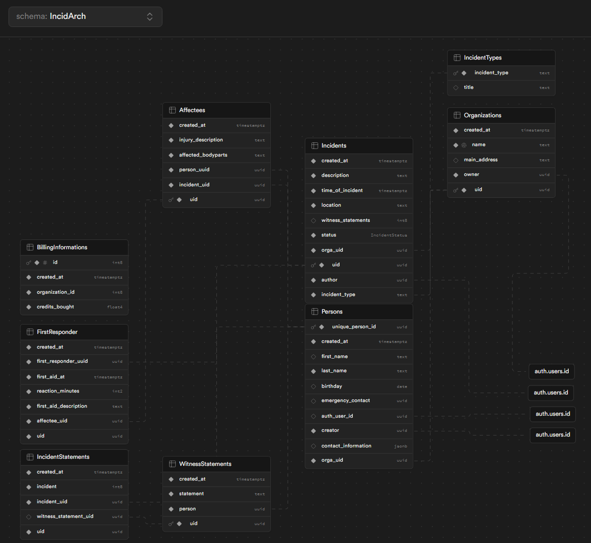

# Software Requirements Specification v3

## Inhaltsverzeichnis
- [Software Requirements Specification v3](#software-requirements-specification-v3)
  - [Inhaltsverzeichnis](#inhaltsverzeichnis)
  - [1. Einführung](#1-einführung)
    - [1.1 Zweck](#11-zweck)
  - [6 Logical View](#6-logical-view)
    - [6.1 Overview](#61-overview)
    - [6.2 Architecturally Significant Design Packages](#62-architecturally-significant-design-packages)
  - [7 Process View](#7-process-view)
  - [8 Deployment View](#8-deployment-view)
  - [9 Implementation View](#9-implementation-view)
  - [Data View](#data-view)
  - [11 Size and Performance](#11-size-and-performance)
  - [12 Quality](#12-quality)

## 1. Einführung

### 1.1 Zweck
Das Software Architecture Document (SAD) dient.. //TODO

## 6 Logical View

### 6.1 Overview

Aus logischer Sicht findet in jedem Fall am Frontend zunächst eine Vor-Validierung statt,  
die anschließend vom Backend legitimiert wird, bevor tatsächliche Änderungen vorgenommen werden.  
Ziel ist es zumindest für die Vorfälle als Kern eine git-ähnliche Historie aufbauen,  
wobei lediglich das Anhängen von Änderungen möglich sein soll, um dem Verfälschen von Berichten vorzubeugen.  

Eine weitere Komponente, im Sinne des Datenschutzes im Bereich der Integrität und Vertraulichkeit,  
stellt die Application-Layer-Encryption dar, die einer Klartext-Abspeicherung in der Datenbank vorbeugen soll.  
Ein entsprechendes Schlüsselmanagement ist nicht angedacht,  
der Applikations-Schlüssel wird jedoch mit dem Start des Backend als Umgebungsvariable bzw. Startparameter übergeben.

### 6.2 Architecturally Significant Design Packages

## 7 Process View

Wir setzen auf transaktionelle Abläufe, die von unserem zustandslosen Backend verarbeitet werden.  
Diese richten sich nach den Use-Cases und sind dort entsprechend in der Ablaufbeschreibung dokumentiert.
Ein großer Vorteil der zustandslosen Verarbeitung ist die einfache Skalierung,  
die nicht zuletzt durch die Verwendung von Postgres-Connection-Pools als gestützt wird.

## 8 Deployment View

Das Deployment der Apps erfolgt im Fall über die beiden marktführenden App-Stores,
den Google Play-Store und den Apple App-Store.  
Die Web-App werden wir über ein CDN statisch bereitstellen,  
was sich aufgrund der losen Kopplung zum Backend anbietet.  
Ein klassischer Anbieter ist hier Cloudflare mit Cloudflare-Pages  
und deren CDN, mit Edge-Nodes in allen großen Rechenzentren.  

Die eigentliche Bereitstellung (Deployment) wird,  
wie der Render-Vorgang des Tech-Blogs,  
voraussichtlich über Github Actions oder einen vergleichbaren Automatisierungs-Services konfiguriert.  
Nicht zuletzt wegen bereits existierenden Workflow-Vorlagen.  

## 9 Implementation View

Im Frontend gehen wird nach dem atomarem Modell vor  
und versuchen möglichst alle Konstrukte in kleine,  
wiederverwendbare Teile zu zerlegen.  
Ähnlich im Backend, hier setzen wir auf Modularität mit der Middleware-zentrierten Architektur.  

## Data View

Für das 

## 11 Size and Performance

Die Größe der Apps spielt eine große Rolle kann bei React Native eine Hürde darstellen.  
Mit dem in Expo vorkonfigurierten Webpack-Bundler ist jedoch eine ausreichende Komprimierung möglich,  
sodass das Frontend auch als relativ leichtgewichtige WebApp bereitgestellt werden kann.  

Um die Performance zu steigern orientieren wir uns an den Best-Practices der jeweiligen Ecosysteme,
sodass in jedem Fall, am Front-/ wie Backend, komplexe Abläufe in kleine,  
testbare Funktionseinheiten unterteilt werden können.  

Der Backend-Code lässt sich in einem open-Beta-Feature von Deno zudem kompilieren,  
um noch bessere Ergebnisse in der Verarbeitungszeit zu erzielen.

## 12 Quality

Im Sinne einer besseren Qualität setzen wir auf einfache Ausgangsbestimmungen und Eigenarbeit.  
Wir verwenden nur TypeScript mit den minimal nötigen Bibliotheken,  
sowie eine automatisierte API-Dokumentationen nach OpenAPI-Spezifikation,  
die mithilfe des OpenAPI-TS-Werkzeugs in eine TypeScript-Definitions-Datei umgewandelt werden kann.

Die Wahl von TypeScript als einzige Entwicklungssprache haben wir ebenfalls im Sinne der Einfachheit getroffen,    
aufgesattelt auf die V8-JavaScript-Engine im Frontend, wie Backend,  
war naheliegend, da wir so eine typsichere und dennoch agile Entwicklung erzielen.