# Software Requirements Specification v3

## Inhaltsverzeichnis
- [Software Requirements Specification v3](#software-requirements-specification-v3)
  - [Inhaltsverzeichnis](#inhaltsverzeichnis)
  - [1. Einführung](#1-einführung)
    - [1.1 Zweck](#11-zweck)
  - [5 Risk Mitigation, Monitoring, and Management (RMMM)](#5-risk-mitigation-monitoring-and-management-rmmm)
    - [RMMM-Tabelle (Version 1.0)](#rmmm-tabelle-version-10)
    - [Legende zur RMMM-Tabelle](#legende-zur-rmmm-tabelle)
  - [6 Logical View](#6-logical-view)
    - [6.1 Overview](#61-overview)
    - [6.2 Architecturally Significant Design Packages](#62-architecturally-significant-design-packages)
  - [7 Process View](#7-process-view)
  - [8 Deployment View](#8-deployment-view)
  - [9 Implementation View](#9-implementation-view)
  - [10 Data View](#10-data-view)
  - [11 Size and Performance](#11-size-and-performance)
  - [12 Quality](#12-quality)

## 1. Einführung

### 1.1 Zweck
Das Software Architecture Document (SAD) dient.. //TODO
## 5 Risk Mitigation, Monitoring, and Management (RMMM)

### RMMM-Tabelle (Version 1.0)

| Risk ID | Category     | Risk Description                                     | Probability | Impact | Risk Score | Mitigation Strategy                                    | Indicator                    | Contingency Plan                                  | Responsible           | Status   | Last Modified Date |
|---------|--------------|------------------------------------------------------|-------------|--------|------------|--------------------------------------------------------|-------------------------------|--------------------------------------------------|----------------------|----------|--------------------|
| T1      | Technisch    | Unzureichende Sicherung sensibler Daten              | Mittel      | Hoch   | 3          | Umfassende Verschlüsselung einführen                   | Häufigkeit von Sicherheitsverletzungen            | Notfallplan bei Datenpannen aktivieren            | IT-Sicherheitsteam   | Offen    | 22.04.2024         |
| T2      | Technisch    | Performance-Probleme durch viele Nutzer              | Hoch        | Mittel | 2          | Skalierbare Cloud-Infrastruktur nutzen                 | CPU und RAM Auslastung        | Mehr Ressourcen bei Bedarf hinzufügen            | IT-Abteilung         | Offen    | 22.04.2024         |
| T3      | Betrieblich  | Ausfall kritischer Infrastruktur                     | Niedrig     | Hoch   | 2          | Regelmäßige Wartung und Failover-Systeme               | Systemausfallrate             | Schnelle Wiederherstellungsprozesse aktivieren   | Betriebsteam         | Offen    | 22.04.2024         |
| T4      | Rechtlich    | Nicht-Einhaltung der Datenschutzgesetze              | Mittel      | Sehr Hoch | 4       | Schulungen zum Datenschutz für alle Mitarbeiter        | Audit-Ergebnisse              | Rechtsberatung und Überarbeitung der Richtlinien | Rechtsabteilung      | Offen    | 22.04.2024         |

### Legende zur RMMM-Tabelle

- **Risk ID**: Eindeutiger Identifikator für das Risiko.
- **Category**: Kategorie des Risikos, z.B. technisch, organisatorisch.
- **Risk Description**: Beschreibung des Risikos.
- **Probability**: Wahrscheinlichkeit des Eintretens (Niedrig, Mittel, Hoch).
- **Impact**: Auswirkung auf das Projekt bei Eintreten des Risikos (Niedrig, Mittel, Hoch, Sehr Hoch).
- **Risk Score**: Numerische Bewertung des Gesamtrisikos, kombiniert aus Wahrscheinlichkeit und Auswirkung, auf einer Skala von 1 (niedrig) bis 4 (sehr hoch).
- **Mitigation Strategy**: Strategie zur Minderung des Risikos.
- **Indicator**: Kennzahlen oder Indikatoren, die auf das Risiko hinweisen könnten.
- **Contingency Plan**: Notfallplan, falls das Risiko eintritt.
- **Responsible**: Verantwortliche Person oder Abteilung.
- **Status**: Aktueller Status des Risikomanagements.
- **Last Modified Date**: Datum der letzten Aktualisierung der Risikoinformation.

## 6 Logical View

### 6.1 Overview

Aus logischer Sicht findet in jedem Fall am Frontend zunächst eine Vor-Validierung statt,  
die anschließend vom Backend legitimiert wird, bevor tatsächliche Änderungen vorgenommen werden.  
Ziel ist es zumindest für die Vorfälle als Kern eine git-ähnliche Historie aufbauen,  
wobei lediglich das Anhängen von Änderungen möglich sein soll, um dem Verfälschen von Berichten vorzubeugen.  

Eine weitere Komponente, im Sinne des Datenschutzes im Bereich der Integrität und Vertraulichkeit,  
stellt die Application-Layer-Encryption dar, die einer Klartext-Abspeicherung in der Datenbank vorbeugen soll.  
Ein entsprechendes Schlüsselmanagement ist nicht angedacht,  
der Applikations-Schlüssel wird jedoch mit dem Start des Backend als Umgebungsvariable bzw. Startparameter übergeben.

### 6.2 Architecturally Significant Design Packages

## 7 Process View

Wir setzen auf transaktionelle Abläufe, die von unserem zustandslosen Backend verarbeitet werden.  
Diese richten sich nach den Use-Cases und sind dort entsprechend in der Ablaufbeschreibung dokumentiert.
Ein großer Vorteil der zustandslosen Verarbeitung ist die einfache Skalierung,  
die nicht zuletzt durch die Verwendung von Postgres-Connection-Pools als gestützt wird.

## 8 Deployment View

Das Deployment der Apps erfolgt im Fall über die beiden marktführenden App-Stores,
den Google Play-Store und den Apple App-Store.  
Die Web-App werden wir über ein CDN statisch bereitstellen,  
was sich aufgrund der losen Kopplung zum Backend anbietet.  
Ein klassischer Anbieter ist hier Cloudflare mit Cloudflare-Pages  
und deren CDN, mit Edge-Nodes in allen großen Rechenzentren.  

Die eigentliche Bereitstellung (Deployment) wird,  
wie der Render-Vorgang des Tech-Blogs,  
voraussichtlich über Github Actions oder einen vergleichbaren Automatisierungs-Services konfiguriert.  
Nicht zuletzt wegen bereits existierenden Workflow-Vorlagen.  

## 9 Implementation View

Im Frontend gehen wird nach dem atomarem Modell vor  
und versuchen möglichst alle Konstrukte in kleine,  
wiederverwendbare Teile zu zerlegen.  
Ähnlich im Backend, hier setzen wir auf Modularität mit der Middleware-zentrierten Architektur.  

## 10 Data View

Das vorläufige ER-Diagramm für unsere verschlüsselte/private Persistierung:

```mermaid

erDiagram
    %% # Tables
    %% "🏦🔒" Has to be locked by some sort of key.
    %% "🃏🔑": Application Key - provided @runtime

    User {
        string uuid "🗝️PK"
        %% auth
        string emailHash "#hashed for initial identification"
        string email "🃏🔑 (to decrypt @runtime)"
        string salt "## RandomString ##"
        string password "#Hashed(clr_pw + salt)"
        %% personal information
        string first_name "🏦🔒"
        string last_name "🏦🔒"
        enum gender "<Optional> (🏦🔒)" 
        date birthday "<Optional> (🏦🔒)"
        string emergency_number "🏦🔒"
        bool locked "for new Authenticated Requests"
    }

    Incident {
        %% on User alteration this guy gets a new intermediate key
        %% and all the dependencies have to be updated..
        %% Change should only be commitable as full change object!
        number incident_id "🗝️PK"
        %%string intermed_key "🔓FK  (?!)"
        %% would allow adding new valid obj creation for everyone!
        %%  => possibly encrypt it alongside intermediate_key_access?
        blob encoded_incident "🏦🔒"
    }
    
    EncodedIncident {
        object IncidentDocument
    }

    OrganizationUserRole {
        uuid user_id "🔓FK"
        number organization_id "🔓FK"
        enum application_permission  "🃏🔑: r_team|rw_team|r_department|rw_department|r_organization|rw_organization|r_all|rw_all"
    }
    
    Organization {
        number organization_id "🗝️PK"
        uuid owner "🔓FK"
        number organization_key_file "Public-Key-Set (! Should not be exposed.)"
        number fallback_key "🔓FK"
        string name
        enum corporate_type
        boolean lock "If set freezes all operations on organization."
    }
    
    Metadata {
        %% Startdatum für statistische Auswertung
        date start_of_probing
        string jwt_secret "API-Integrity"
        string general_key "General-Public-Key (Fallback, etc.)"
        string application_key "🃏🔑 Encrypts backend_processable @runtime"
    }

%%    IntermediateKeystore {
%%        number d "🔓FK"
%%        number fallback_key "🔓FK"
%%    }

    UserKeystore {
        number key_id "🗝️PK"
        uuid user "🔓FK"
        string key_file "Public-Key-Set"
    }

    UserIncidentKey {
        %% could also describe role of user in incident for organization
        %% althoug thats versioned inside the IncidentDocument
        uuid vault_owner "🔓FK"
        number incident_id "🔓FK"
        string my_intermediate_key_access "Incident decrypting key"
    }

    OrganizationIncidentKey {
        %% could also describe role of user in incident for organization
        %% althoug thats versioned inside the IncidentDocument
        uuid vault_owning_organization "🔓FK"
        number incident_id "🔓FK"
        string orga_intermediate_key_access "Incident decrypting key"
    }

    FallbackKeystore {
        %% Row Storage to prevent attackers from concluding priv-keys
        %% yet practically you can regenerate
        number fallback_key
        string priv_key_file "Encoded with General-Key"
    }

    FallbackRestoration {
        number fallback_key "🔓FK"
        datetime used_at
        number organization_id "🔓FK"
    }

    %% 
    %% # Relations
    %% 
    %% Witness is being recorded..
    %% Person is recorder on zero or more incidents. (or no recorder @all)

    %% make zero imposible & use dummy for 'no permissions'/'bare person'
    Incident ||--|| EncodedIncident: "contains"
    %%Incident ||--|| UserKeystore: "intermediary secures"
    User ||--|| Organization : "owns with 'rw_all'"
    User }|--|| OrganizationUserRole : "is part of"
    Organization ||--|{ OrganizationUserRole : "is part of" 

    UserKeystore }|--|| User : "identifies"

    Metadata ||--|{ Organization : "is within"

    FallbackKeystore ||--o| Organization : "secures on fallback"

    %% Intermediary Keys
    OrganizationIncidentKey ||--|| Incident : "secures"
    OrganizationIncidentKey }|--|| Organization : "holds"

    UserIncidentKey }|--|| Incident : "allows for de-/en-cryption"
    UserIncidentKey }|--|| User : "holds"

    %% should log restorations
    %% restiration is opt-out.
    FallbackRestoration }|--|| FallbackKeystore : "logs usage off"
    FallbackRestoration }|--o| Organization : "rescues organization key"

    %% Statistics
    Statistics {
        number organization_id
        blob ongoing_encoded_statistics
        %% could be normalized into chunks of encoded statistics,
        %% althoug some form of procedural statistics would be great.
    }

    EncodedStatistics {

    }

    Statistics ||--|| Organization : "produces and evaluates"
    Statistics ||--|| EncodedStatistics : "stores securly"
```

## 11 Size and Performance

Die Größe der Apps spielt eine große Rolle kann bei React Native eine Hürde darstellen.  
Mit dem in Expo vorkonfigurierten Webpack-Bundler ist jedoch eine ausreichende Komprimierung möglich,  
sodass das Frontend auch als relativ leichtgewichtige WebApp bereitgestellt werden kann.  

Um die Performance zu steigern orientieren wir uns an den Best-Practices der jeweiligen Ecosysteme,
sodass in jedem Fall, am Front-/ wie Backend, komplexe Abläufe in kleine,  
testbare Funktionseinheiten unterteilt werden können.  

Der Backend-Code lässt sich in einem open-Beta-Feature von Deno zudem kompilieren,  
um noch bessere Ergebnisse in der Verarbeitungszeit zu erzielen.

## 12 Quality

Im Sinne einer besseren Qualität setzen wir auf einfache Ausgangsbestimmungen und Eigenarbeit.  
Wir verwenden nur TypeScript mit den minimal nötigen Bibliotheken,  
sowie eine automatisierte API-Dokumentationen nach OpenAPI-Spezifikation,  
die mithilfe des OpenAPI-TS-Werkzeugs in eine TypeScript-Definitions-Datei umgewandelt werden kann.

Die Wahl von TypeScript als einzige Entwicklungssprache haben wir ebenfalls im Sinne der Einfachheit getroffen,    
aufgesattelt auf die V8-JavaScript-Engine im Frontend, wie Backend,  
war naheliegend, da wir so eine typsichere und dennoch agile Entwicklung erzielen.