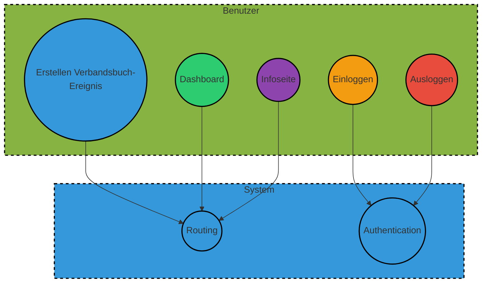

# Handout für das Software-Projekt "IncidArch"

## Projektname
IncidArch

## Statistiken über die Aufwändungen

| Person           | Hauptbeitrag         | Stunden |
|------------------|----------------------|---------|
| Felix Blank      | Backend-Entwicklung | 44      |
| Nick Obreiter    | Frontend-Entwicklung  | 43      |
| Alexander Geier  | Projektmanagement    | 30      |
| Cristiano Gomes  | Qualitätssicherung   | 25      |

### Stunden pro Workflow

| Workflow            | Stunden |
|---------------------|---------|
| Requirement Analyse | 15      |
| Project Management  | 20      |
| Frontend-Entwicklung| 40     |
| Backend-Entwicklung | 30     |
| Testing/QA          | 15     |

### Stunden pro Phase

| Phase       | Stunden |
|-------------|---------|
| Planung     | 30      |
| Umsetzung   | 60    |
| Testing     | 10     |
| Dokumentation| 20      |

## Overall Use Case Diagram
Siehe Use Case Diagram im Repository. Die Schwerpunkte unserer Entwicklung sind:
- Einloggen
- Ausloggen
- Erstellen eines neuen Verbandsbuch-Ereignisses
- Dashboard

## Architekturstile
Unsere Architektur basiert auf klaren Prinzipien und Entscheidungen:

- **Frontend-Entwicklung mit React Native und Expo:**
  - *Cross-Platform-Fähigkeit:* Mit React Native und Expo können wir eine Anwendung entwickeln, die sowohl auf Android als auch auf iOS und im Web läuft, wodurch Entwicklungszeit reduziert wird.
  - *Effektive Entwicklung:* React Native bietet eine effiziente Entwicklungsumgebung mit Hot-Reloading und einer großen Community, was zu schnelleren Entwicklungszyklen führt.

- **Backend-Entwicklung mit TypeScript und Deno:**
  - *Typsicherheit:* TypeScript bringt statische Typisierung in JavaScript, was zu sichererem Code führt.
  - *Deno als moderne Laufzeitumgebung:* Mit Deno setzen wir auf eine moderne Laufzeitumgebung für TypeScript im Backend, die Sicherheit und Effizienz bietet.

- **API-Validierung mit Zod-OpenAPI:**
  - *Standardisierte und sichere API-Kommunikation:* Zod-OpenAPI ermöglicht die Definition von Datenstrukturen und API-Schemas in TypeScript, was zu einer verbesserten Sicherheit und Robustheit der Anwendung beiträgt.

- **Projektmanagement und Versionskontrolle mit GitHub:**
  - *Effizientes Teamwork:* GitHub ermöglicht effizientes Teamwork durch Funktionen wie Pull Requests, Issues und Discussions.
  - *Versionskontrolle:* Git und GitHub bieten eine robuste Versionskontrolle, die die Zusammenarbeit im Team erleichtert.

## Software Tools/Platforms/Techniken
Unsere Auswahl an Tools, Plattformen und Techniken trägt dazu bei, ein effizientes und skalierbares Entwicklungsprojekt zu gewährleisten:

- **GitHub:**
  - *Versionskontrolle und Kollaboration:* GitHub ermöglicht es dem Team, gemeinsam am Code zu arbeiten, Pull Requests zu überprüfen und Issues zu verwalten.

- **React Native und Expo:**
  - *Cross-Platform-Entwicklung:* React Native und Expo ermöglichen die Entwicklung von plattformübergreifenden mobilen Anwendungen mit einer einzigen Codebasis.

- **TypeScript:**
  - *Statische Typisierung:* TypeScript bringt statische Typisierung in JavaScript, um die Codequalität zu verbessern und Fehler frühzeitig zu erkennen.

- **Deno:**
  - *Moderne Laufzeitumgebung:* Deno bietet eine moderne, sichere und effiziente Laufzeitumgebung für TypeScript im Backend.

- **Markdown:**
  - *Dokumentation:* Markdown wird für die Erstellung von klaren und leicht verständlichen Dokumentationen verwendet.

- **Visual Studio Code:**
  - *Integrierte Entwicklungsumgebung:* Visual Studio Code bietet eine leistungsstarke IDE für die Entwicklung in TypeScript und React Native.

- **Docker (nicht aktiv genutzt, aber vorbereitet für zukünftige Verwendung):**
  - *Containerisierung:* Docker ermöglicht die Containerisierung von Anwendungen für eine effiziente Bereitstellung und Skalierung.
