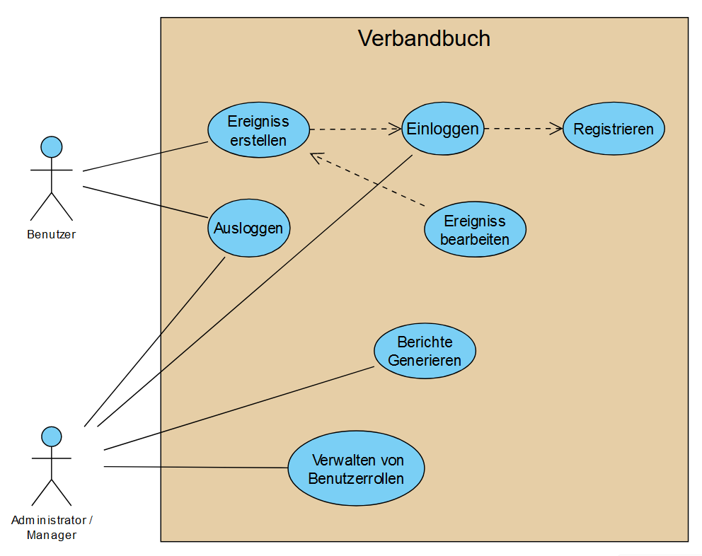

# Software Requirements Specification 

## Inhaltsverzeichnis
- [Inhaltsverzeichnis](#inhaltsverzeichnis)
- [Einführung](#1-einführung)
    - [Zweck](#11-zweck)
    - [Umfang](#12-umfang)
    - [Definitionen, Akronyme und Abkürzungen](#13-definitionen-akronyme-und-abkürzungen)
    - [Übersicht](#15-übersicht)
- [Gesamtbeschreibung](#2-gesamtbeschreibung)
    - [Vision](#21-vision)
    - [Use Case Diagram](#22-use-case-diagram)
	- [Technologie Stack](#23-technologie-Stack)
- [Spezifische Anforderungen](#3-spezifische-anforderungen)
    - [Funktionalität](#31-funktionalität)
    - [Benutzerfreundlichkeit](#32-benutzerfreundlichkeit)
    - [Zuverlässigkeit](#33-zuverlässigkeit)
    - [Leistung](#34-leistung)
    - [Unterstützbarkeit](#35-unterstützbarkeit)
    - [Entwurfsbeschränkungen](#36-entwurfsbeschränkungen)
    - [Anforderungen an die Online-Benutzerdokumentation und das Hilfesystem](#37-anforderungen-an-die-online-benutzerdokumentation-und-das-hilfesystem)
    - [Gekaufte Komponenten](#gekaufte-komponenten)
    - [Schnittstellen](#39-schnittstellen)
    - [Lizenzanforderungen](#310-lizenzanforderungen)
    - [Rechtliche, Urheberrechts- und andere Hinweise](#311-rechtliche-urheberrechts-und-andere-hinweise)
    - [Anwendbare Standards](#312-anwendbare-standards)
- [Unterstützende Informationen](#4-unterstützende-informationen)

## 1. Einführung

### 1.1 Zweck
Diese Spezifikation der Softwareanforderungen (SRS) beschreibt alle Spezifikationen für die Anwendung "IncidArch". Sie enthält einen Überblick über dieses Projekt und seine Vision, detaillierte Informationen über die geplanten Funktionen und Rahmenbedingungen des Entwicklungsprozesses.

### 1.2 Umfang
Das Projekt wird als Android-App, IPhone-App und als Website umgesetzt.

Das Verbandsbuch-System soll folgende Hauptfunktionen bieten:

- **Ereigniserstellung und -bearbeitung**: Benutzer sollen in der Lage sein, neue Verbandsbuch-Ereignisse zu erstellen und bestehende Ereignisse zu bearbeiten. Die erstellten Ereignisse müssen Datum, Uhrzeit, Ort, Art des Vorfalls und eine Beschreibung enthalten. Die Änderungen müssen im Verbandbuch sichtbar sein.

- **Dashboard-Übersicht**: Das System soll ein Dashboard bereitstellen, das eine Übersicht über alle Verbandsbuch-Ereignisse bietet. Dieses Dashboard sollte Filter- und Suchfunktionen für verschiedene Zeiträume und Kategorien umfassen. Diagramme und Grafiken zur Visualisierung von Trends und Mustern sollen ebenfalls verfügbar sein.

- **Berichterstellung**: Administratoren sollen die Möglichkeit haben, benutzerdefinierte Berichte basierend auf verschiedenen Kriterien zu generieren. Diese Berichte sollten in verschiedenen Formaten (PDF, Excel) herunterladbar sein und alle relevanten Informationen zu den Ereignissen enthalten.

- **Benutzerverwaltung und Rollenzuweisung**: Systemadministratoren sollen Benutzerrollen erstellen, bearbeiten und löschen können. Vordefinierte Rollen wie "Mitarbeiter," "Sicherheitsbeauftragter" und "Manager" sollen vorhand sein, und Administratoren sollen individuellen Benutzern oder Benutzergruppen Rollen und Berechtigungen zuweisen können. Diese Rollen sollen die Aktionen regeln, die ein Benutzer im Verbandsbuch-System ausführen kann.

- **Benachrichtigungen**: Sicherheitsbeauftragte sollen automatische Benachrichtigungen erhalten, wenn Vorfallskategorien oder Schweregrade im Verbandsbuch erfasst werden. Diese Benachrichtigungen sollen anpassbar sein und in Echtzeit gesendet werden, um auf schwerwiegende Vorfälle schnell reagieren zu können.

### 1.3 Definitionen, Akronyme und Abkürzungen

| Abkürzung | Erklärung                               |

| ----------- | -------------------------------------- |

| SRS       | Software Requirements Specification    |
| DGUV      | Deutsche Gesetzliche Unfallversicherung |
| DSGVO     | Datenschutz-Grundverordnung            |
| FAQ       | Häufig gestellte Fragen                |
| API       | Application Programming Interface     |

### 1.5 Übersicht
Im folgenden Kapitel finden Sie einen Überblick über dieses Projekt mit Vision und der Gesamtübersicht des Anwendungsfalls. Das dritte Kapitel (Spezifikation der Anforderungen) liefert weitere Details zu den spezifischen Anforderungen in Bezug auf Funktionalität, Benutzerfreundlichkeit und Designparameter. Schließlich gibt es ein Kapitel mit unterstützenden Informationen.
    
## 2. Gesamtbeschreibung

### 2.1 Vision
Befreien Sie sich von der Last handschriftlich ausgefüllter Unfallberichte
und dem Chaos von Papierstapeln mit schwer entzifferbaren Vorfällen. 
Digitale Unfallprotokolle sind nicht nur auf dem Vormarsch – sie 
sind bereits hier und erleichtern Ihren Alltag erheblich. 
Erfüllen Sie Ihre Dokumentationspflicht nach 
DGUV § 24 Abs. 6 einfach, sicher und digital. Alle Daten werden 
nach DSGVO ausschließlich in Europa verarbeitet und gespeichert. 
Schluss mit dem lästigen Papierkram und herzlich willkommen zu einer 
effizienteren, modernen und rechtlich konformen Lösung.

### 2.2 Use Case Diagram

### 2.3 Technologie Stack
Der Technologie Stack den wir benutzen:

Typescript (als Basis & einzige Sprache)  
👇  
Deno (moderne TS Runtime im Backend)  
👇  
Hono WebStandard Framework  
👇  
Zod-OpenAPI (API & Validierung)  
🌐  
React Native (Frontend)  
☝️  
Expo (Frontend)  

---

Github Actions (Deployment)  
Docker (Deployment)  
GitHub (Development & PM)  

## 3. Spezifische Anforderungen

### 3.1 Funktionalität
In diesem Abschnitt wird die verschiedenen Anwendungsfälle und ihre Funktionalität erläutert, die im Use-Case-Diagramm dargestellt sind.
Bis Dezember planen wir die Implementierung von:
- 3.1.1 Ein Konto erstellen
- 3.1.2 Einloggen
- 3.1.3 Ausloggen
- 3.1.4 Erstellen eines neuen Verbandsbuch-Ereignisses
- 3.1.5 Bearbeiten von Verbandsbuch-Ereignissen

Bis Juni möchten wir implementieren:
- 3.1.6 Dashboard-Überblick über Verbandsbuch-Ereignisse
- 3.1.7 Generieren von Berichten über Verbandsbuch-Ereignisse
- 3.1.8 Verwalten von Benutzerrollen und Rechten im Verbandsbuch-System
- 3.1.9 Erhalten von automatischen Benachrichtigungen für schwerwiegende Vorfälle

#### 3.1.1 Ein Konto erstellen
Diese Funktion ermöglicht es Benutzern, ein neues Konto im Verbandsbuch-System zu erstellen. Benutzer können ihre persönlichen Informationen angeben, um ein Konto zu registrieren. Nach erfolgreicher Registrierung werden sie in der Lage sein, sich im System anzumelden und auf die Funktionen zuzugreifen.

[Ein Konto erstellen](use_cases/UC1_Konto_Erstellen.md)

#### 3.1.2 Einloggen
Die Einloggen-Funktion ermöglicht es Benutzern, sich in ihr Verbandsbuch-Konto anzumelden. Benutzer müssen ihre Anmeldeinformationen eingeben, um auf die Funktionen des Systems zuzugreifen. Nach dem erfolgreichen Login können sie auf ihre Verbandsbuch-Ereignisse und andere relevante Informationen zugreifen.

[Einloggen](use_cases/UC2_Einloggen.md)

#### 3.1.3 Ausloggen
Die Ausloggen-Funktion ermöglicht es Benutzern, sich sicher aus ihrem Verbandsbuch-Konto abzumelden. Dies ist wichtig, um die Sicherheit und Privatsphäre der Benutzer zu gewährleisten. Nach dem Ausloggen haben Benutzer keinen Zugriff auf ihr Konto, es sei denn, sie melden sich erneut an.

[Ausloggen](use_cases/UC3_Ausloggen.md)

#### 3.1.4 Erstellen eines neuen Verbandsbuch-Ereignisses
Diese Funktion ermöglicht Benutzern, ein neues Verbandsbuch-Ereignis zu erstellen. Benutzer können Daten wie Datum, Uhrzeit, Ort, Art des Vorfalls und eine Beschreibung des Vorfalls eingeben. Nach dem Erstellen des Ereignisses wird es im Verbandsbuch sichtbar sein.

[Erstellen eines neuen Verbandsbuch-Ereignisses](use_cases/UC4_Ereigniss_Erstellen.md)

#### 3.1.5 Bearbeiten von Verbandsbuch-Ereignissen
Die Funktion "Bearbeiten von Verbandsbuch-Ereignissen" ermöglicht es Benutzern, bestehende Ereignisse im Verbandsbuch zu bearbeiten. Sie können Daten wie Datum, Uhrzeit, Ort, Art des Vorfalls und die Beschreibung des Vorfalls aktualisieren. Die vorgenommenen Änderungen werden im Verbandsbuch gespeichert.

[Bearbeiten von Verbandsbuch-Ereignissen](use_cases/UC5_Ereigniss_Bearbeiten.md)

#### 3.1.6 Dashboard-Überblick über Verbandsbuch-Ereignisse
Diese Funktion bietet den Benutzern einen zentralen Dashboard-Überblick über alle Verbandsbuch-Ereignisse. Das Dashboard enthält Filter- und Suchfunktionen, um Ereignisse für verschiedene Zeiträume und Kategorien anzuzeigen. Darüber hinaus können Diagramme und Grafiken zur Visualisierung von Trends und Mustern angezeigt werden.

[Dashboard-Überblick über Verbandsbuch-Ereignisse](use_cases/UC6_Dashboard.md)

#### 3.1.7 Generieren von Berichten über Verbandsbuch-Ereignisse
Benutzer mit Administratorrechten können Berichte über Verbandsbuch-Ereignisse generieren. Diese Berichte können anhand von verschiedenen Kriterien, wie Datum oder Art des Vorfalls, erstellt werden. Die Berichte können in verschiedenen Formaten (PDF, Excel) heruntergeladen werden und enthalten umfassende Informationen zu den Ereignissen.

[Generieren von Berichten über Verbandsbuch-Ereignisse](use_cases/UC7_Berichte_Generieren.md)

#### 3.1.8 Verwalten von Benutzerrollen und Rechten im Verbandsbuch-System
Diese Funktion ermöglicht es Systemadministratoren, Benutzerrollen zu erstellen, zu bearbeiten und zu löschen. Es gibt vordefinierte Rollen wie "Mitarbeiter," "Sicherheitsbeauftragter" und "Manager," die unterschiedliche Rechte haben. Administratoren können individuellen Benutzern oder Benutzergruppen Rollen und Berechtigungen zuweisen. Rollen bestimmen, welche Aktionen ein Benutzer im Verbandsbuch-System ausführen kann, wie das Erstellen, Bearbeiten oder Löschen von Ereignissen.

[Verwalten von Benutzerrollen und Rechten im Verbandsbuch-System](use_cases/UC8_Verwalten_Benutzerrollen.md)

#### 3.1.9 Erhalten von automatischen Benachrichtigungen für schwerwiegende Vorfälle
Sicherheitsbeauftragte können automatische Benachrichtigungen erhalten, wenn schwerwiegende Vorfälle im Verbandsbuch registriert werden. Diese Benachrichtigungen enthalten wichtige Details wie den Zeitpunkt des Vorfalls, die Art des Vorfalls und den Standort. Die Benachrichtigungen sind anpassbar, sodass der Sicherheitsbeauftragte die Kategorien festlegen kann, für die er Benachrichtigungen erhalten möchte. Die Benachrichtigungen werden in Echtzeit gesendet, um eine schnelle Reaktion auf schwerwiegende Vorfälle zu ermöglichen. Der Sicherheitsbeauftragte kann die Benachrichtigungseinstellungen nach Bedarf ändern.

[Erhalten von automatischen Benachrichtigungen für schwerwiegende Vorfälle](use_cases/UC9_Benachrichtigungen.md)

#### #TODO noch mehr?

### 3.2 Benutzerfreundlichkeit
Wir planen, die Benutzeroberfläche so intuitiv und selbsterklärend wie möglich zu gestalten, um dem Benutzer ein möglichst komfortables Nutzungserlebnis zu bieten. Obwohl ein FAQ-Dokument verfügbar sein wird, sollte es nicht notwendig sein, es zu verwenden.

#### 3.2.1 Keine Schulungszeit erforderlich
Unser Ziel ist, dass ein Benutzer die Android-Anwendung installiert, öffnet und alle Funktionen ohne Erklärung oder Hilfe verwenden kann.

### 3.3 Zuverlässigkeit

#### 3.3.1 Verfügbarkeit
Der Server soll 95% der Zeit verfügbar sein. Das bedeutet auch, dass wir die "Stoßzeiten" unserer App ermitteln müssen, da die Ausfallzeit des Servers nur akzeptabel ist, wenn so wenig wie möglich Benutzer die App verwenden möchten.

#### 3.3.2 Fehlerquote
Unser Ziel ist, dass keine Daten verloren gehen. Dies ist wichtig, damit die Spielrunden auch nach einem Serverausfall fortgesetzt werden können.

### 3.4 Leistung

#### 3.4.1 Kapazität
Das System sollte in der Lage sein, Tausende von Anfragen zu verarbeiten. Es sollte auch möglich sein, so viele Benutzer zu registrieren, wie erforderlich sind.

#### 3.4.2 Speicher
Smartphones bieten nicht viel Speicherplatz. Daher streben wir an, den benötigten Speicherplatz so gering wie möglich zu halten.

#### 3.4.3 App-Leistung / Reaktionszeit
Um die beste App-Leistung zu bieten, streben wir an, die Reaktionszeit so gering wie möglich zu halten. Dies verbessert das Benutzererlebnis erheblich.

### 3.5 Unterstützbarkeit

#### 3.5.1 Codierungsstandards
Wir werden den Code unter Verwendung aller gängigen Clean-Code-Standards schreiben. Beispielsweise werden wir Variablen und Methoden nach ihren Funktionalitäten benennen. Dies hält den Code für jeden leicht lesbar und erleichtert die weitere Entwicklung erheblich.

#### 3.5.2 Teststrategie
Die Anwendung wird eine hohe Testabdeckung haben, und alle wichtigen Funktionen und Randfälle sollten getestet werden. Weitere Fehler in der Implementierung werden sofort entdeckt, und es wird einfach sein, den Fehler zu lokalisieren.

### 3.6 Entwurfsbeschränkungen

### 3.7 Anforderungen an die Online-Benutzerdokumentation und das Hilfesystem
Die Verwendung der App sollte so intuitiv wie möglich sein, sodass keine weiteren Dokumentationen erforderlich sind. Wenn der Benutzer Hilfe benötigt, werden wir eine "Hilfe"-Schaltfläche in der App implementieren, die ein FAQ und ein Formular zur Kontaktaufnahme mit dem Entwicklungsteam enthält.

### 3.8 Gekaufte Komponenten
Wir haben derzeit keine gekauften Komponenten. Wenn in Zukunft gekaufte Komponenten vorhanden sind, werden wir sie hier auflisten.

### 3.9 Schnittstellen

#### 3.9.1 Benutzeroberflächen

Die zu implementierenden Benutzeroberflächen sind:

1. **Anmeldungsseite**: Die Seite, auf der Benutzer sich in ihrem Verbandsbuch-Konto anmelden können, indem sie ihre Anmeldeinformationen eingeben.

2. **Registrierungsseite**: Die Seite, auf der Benutzer ein neues Konto erstellen können, indem sie persönliche Informationen eingeben.

3. **Haupt-Dashboard**: Ein Dashboard, das einen Überblick über alle Verbandsbuch-Ereignisse bietet. Dieses Dashboard enthält Filter- und Suchfunktionen sowie Diagramme zur Visualisierung von Trends.

4. **Seite zur Ereigniserstellung**: Eine Seite, auf der Benutzer neue Verbandsbuch-Ereignisse erstellen können, indem sie Datum, Uhrzeit, Ort, Art des Vorfalls und eine Beschreibung eingeben.

5. **Seite zur Bearbeitung von Ereignissen**: Eine Seite, auf der Benutzer bestehende Verbandsbuch-Ereignisse bearbeiten können, um Informationen zu aktualisieren.

6. **Berichterstellungsoberfläche**: Eine Oberfläche, auf der Administratoren benutzerdefinierte Berichte über Verbandsbuch-Ereignisse generieren können.

7. **Benutzerverwaltungsseite**: Eine Seite, auf der Systemadministratoren Benutzerrollen und Berechtigungen verwalten können.

8. **Benachrichtigungseinstellungsseite**: Eine Seite, auf der Sicherheitsbeauftragte Benachrichtigungseinstellungen anpassen können, um Benachrichtigungen für schwerwiegende Vorfälle zu konfigurieren.

#### 3.9.2 Hardware-Schnittstellen

Sind clientseitig entsprechend der React Native Dokumentation zu verwenden.  

#### 3.9.3 Software-Schnittstellen

Werden in der impliziten OpenAPI-Spezifikation des Backends vorgegeben
und sind über den API-Endpoint des Backends `/doc` abgerufen _(eq. `http://example.com/api/v1/doc`)_.

#### 3.9.4 Kommunikationsschnittstellen

Es wird hauptsächlich das Hyper-Text-Transfer-Protocol (HTTP) verwendet,  
um die Backend <-> Frontend-Kommunikation zu ermöglichen.  
Standardmäßig werden wir REST/JSON verwenden  
und da Hono zudem das Remote-Procedure-Call-Protokoll (RPC) ermöglicht,  
bietet sich eine weitere alternative in einem (noch) kompakteren Datenformat als JSON an,  
zumal wir primär mit JSON arbeiten werden.

### 3.10 Lizenzanforderungen

Wir verwenden ausschließlich FOSS unter freien Lizenzen,  
wie der MIT-Lizenz.

### 3.11 Rechtliche, Urheberrechts- und andere Hinweise

Unsere Ausarbeitungen sind zunächst unserem, individuellen Urheberrecht nach geschützt,  
solange wir uns nicht im Konsens auf eine Lizenzänderung geeinigt haben.

### 3.12 Anwendbare Standards
Die Entwicklung wird den gängigen Clean-Code-Standards und Namenskonventionen folgen.

## 4. Unterstützende Informationen
Für weitere Informationen können Sie das IncidArch Team kontaktieren oder unseren [IncidArch Blog](https://dh-karlsruhe.github.io/IncidArch-Blog/) überprüfen.
Die Teammitglieder sind:
- Felix Blank
- Nick Obreiter
- Alexander Geier
- Cristiano Gomes
