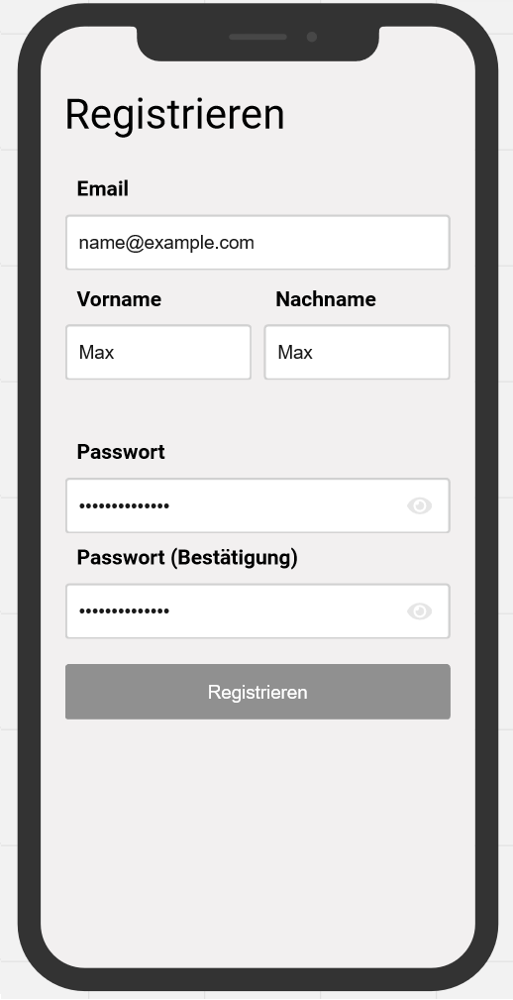

# Use-Case Spezifikation: Konto Erstellen

# 1. Konto Erstellen

## 1.1 Kurzbeschreibung
Dieser Anwendungsfall ermöglicht es jedem, sich zu registrieren und ein Konto zu erstellen. Die Daten werden sicher in unserer Datenbank gespeichert.

## 1.2 Mockup

# 2. Ablauf von Events

## 2.1 Grundablauf
- Benutzer klickt auf "Registrieren".
- Das Registrierungsfenster wird geöffnet.
- Der Benutzer gibt seine Daten ein.
- Der Benutzer klickt auf "Senden".
- Die Daten werden validiert und an die Datenbank gesendet.

## 2.2 Sequenzdiagramm

#### # TODO woche 4

# 3. Besondere Anforderungen
Der Benutzer benötigt eine E-Mail-Adresse, um sich zu registrieren.

# 4. Vorbedingungen
Die Vorbedingungen für diesen Anwendungsfall sind:
1. Der Benutzer hat die App gestartet.
2. Der Benutzer klickt auf "Registrieren".

# 5. Nachbedingungen

Der Benutzer wird für die jeweilige Organisation > Abteilung > Team von einem Administrator freigegeben,
damit es nicht zu Datenlecks kommt.

# 6. Aufwandsschätzung
Für diese Funktionalität wird ein Aufwand von 7 Punkten geschätzt
