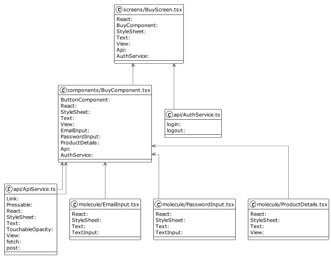
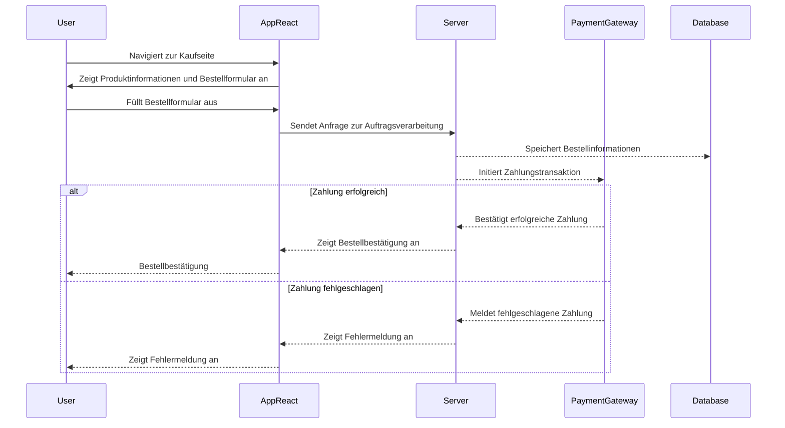

# Use-Case Spezifikation: Bezahlvorgang

# 1. Bezahlvorgang

## 1.1 Kurzbeschreibung
Der Bezahlvorgang beschreibt den Use-Case,  
in dem der Benutzer ein Kontingent erwirbt,
um später Vorfälle archivieren zu können.

## 1.2 Mockup
> TODO

## 1.3 UML-Diagramm

# 2. Ablauf von Events

## 2.1 Grundablauf
 - Benutzer möchte Vorfälle archivieren.
 - Benutzer navigiert zu Kaufseite, um ein Kontingent zu erwerben.
 - Benutzer füllt Bestellformular aus.
 - Benutzer wird zu Zahlungsdienstleister weitergeleitet und gibt dort seine Zahlungsdaten an.
 - Benutzer erhält gekauftes Kontingent.

## 2.2 Alternativer Ablauf
Sofern ein Fehler in der Auftragsbearbeitung am Payment Gateway auftritt,
wird der Bezahlvorgang abgebrochen
und der Benutzer kehrt zum (ausgefüllten) Bestellformular zurück.

## 2.3 Sequenzdiagramm

# 3. Besondere Anforderungen

# 4. Vorbedingungen
Die Vorbedingungen für diesen Anwendungsfall sind:
1. Der Benutzer ist in der Anwendung angemeldet.

# 5. Nachbedingungen
Die Benutzer können mit dem gekauften Kontingent Vorfälle archivieren.

# 6. Aufwandsschätzung
Für die Implementierung der Benachrichtigungsfunktion wird ein Aufwand von 10 Punkten geschätzt.
_(Vereinfachung durch einsatz von Zahlungsdienstleistern möglich => +Vertrauen)_

