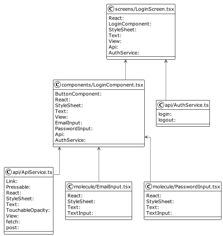
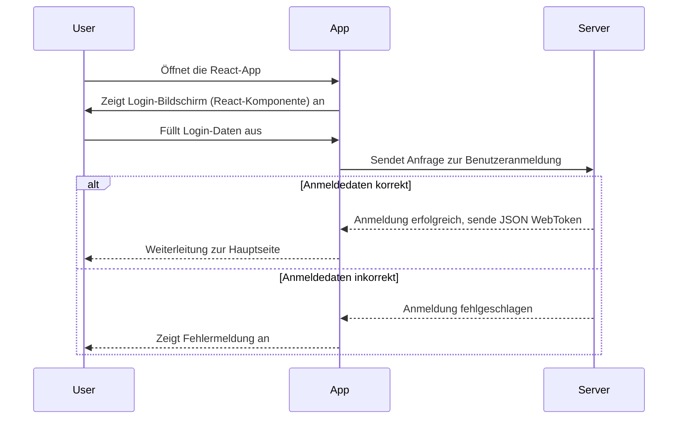

# Use-Case Spezifikation: Einloggen

# 1. Einloggen

## 1.1 Kurzbeschreibung
Dieser Anwendungsfall ermöglicht es jedem Benutzer, mit einem registrierten Account, sich anzumelden.

## 1.2 Mockup

## 1.3 UML-Diagramm

# 2. Ablauf von Events

## 2.1 Grundablauf
- Benutzer öffnet die Anwendung.
- Der Benutzer klickt auf "Einloggen".
- Das Einloggen-Fenster wird geöffnet.
- Der Benutzer gibt seine Anmeldeinformationen (Email und Passwort) ein.
- Der Benutzer klickt auf "Anmelden".
- Die Anmeldeinformationen werden validiert.

## 2.2 Sequenzdiagramm

# 3. Besondere Anforderungen
Der Benutzer muss bereits über ein registriertes Konto verfügen.

# 4. Vorbedingungen
Die Vorbedingungen für diesen Anwendungsfall sind:
1. Der Benutzer hat die App installiert.
2. Der Benutzer klickt auf "Einloggen".

# 5. Nachbedingungen
Die App öffnet die Hauptseite und ermöglicht dem Benutzer den Zugriff auf die Anwendung.

# 6. Aufwandsschätzung
Für diese Funktionalität wird ein Aufwand von 5 Punkten geschätzt.