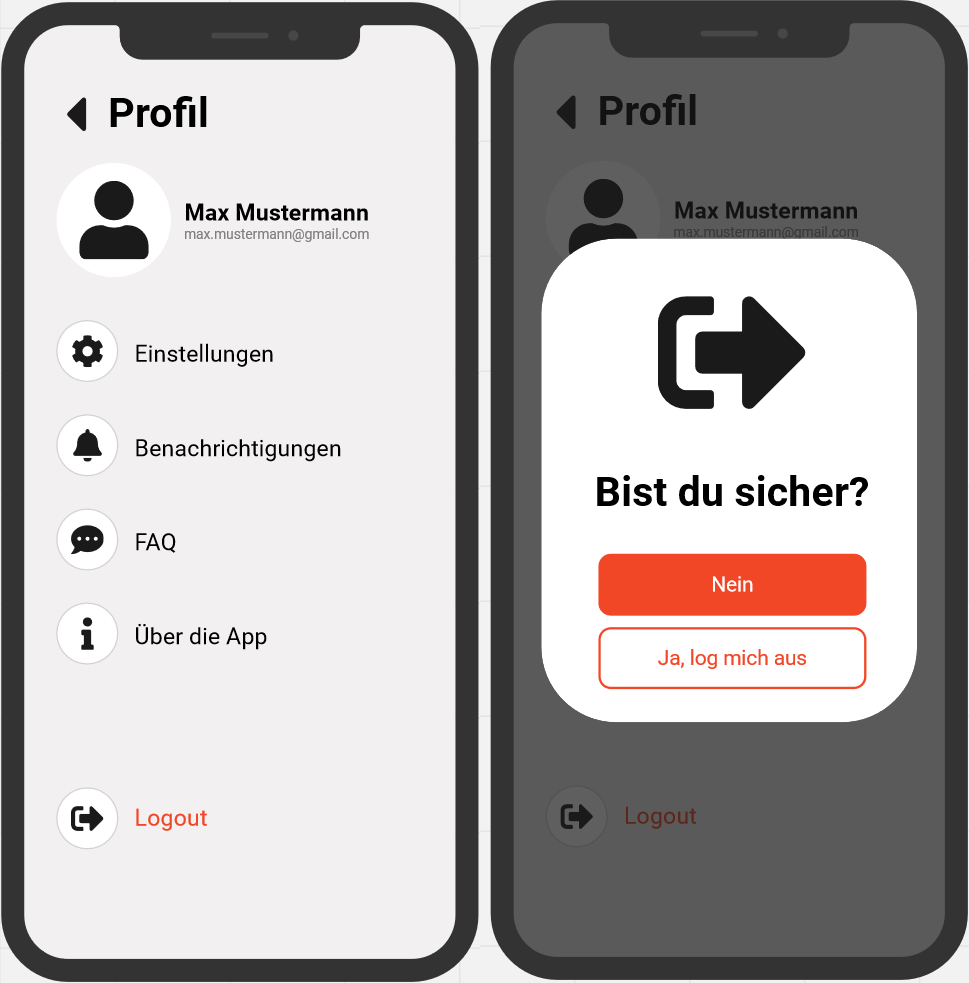
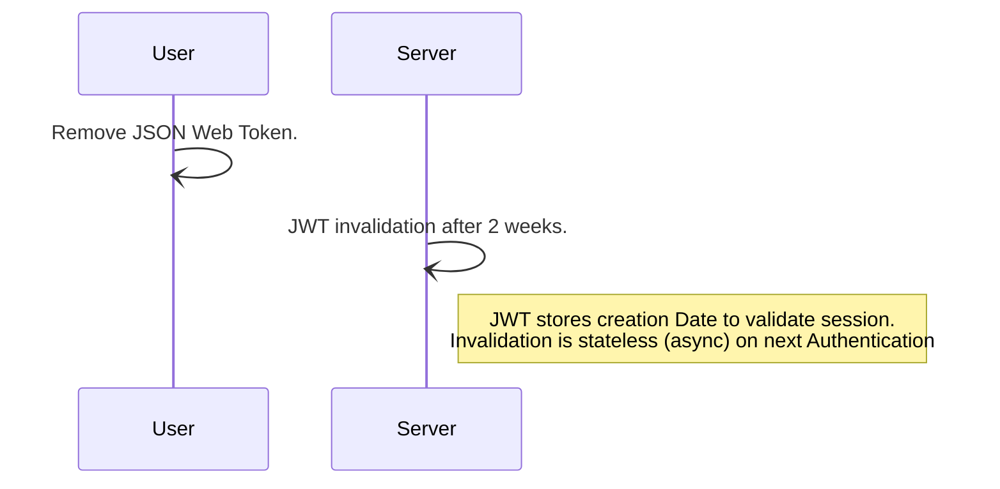

# Use-Case Spezifikation: Ausloggen

# 1. Ausloggen

## 1.1 Kurzbeschreibung
Dieser Anwendungsfall ermöglicht es jedem angemeldeten Benutzer, sich von seinem Konto abzumelden.

## 1.2 Mockup

# 2. Ablauf von Events

## 2.1 Grundablauf
- Der Benutzer befindet sich auf der Hauptseite der Anwendung.
- Der Benutzer klickt auf "Abmelden" oder "Ausloggen".
- Das Abmeldefenster wird geöffnet.
- Der Benutzer bestätigt die Abmeldung.
- Die Abmeldung wird durchgeführt.
- Die Anwendung leitet den Benutzer zur Anmeldeseite weiter.

## 2.2 Sequenzdiagramm

# 3. Besondere Anforderungen
Der Benutzer muss zuvor erfolgreich angemeldet sein.

# 4. Vorbedingungen
Die Vorbedingungen für diesen Anwendungsfall sind:
1. Der Benutzer ist erfolgreich angemeldet.
2. Der Benutzer befindet sich auf der Hauptseite der Anwendung.

# 5. Nachbedingungen
Der Benutzer ist erfolgreich abgemeldet und wird zur Anmeldeseite weitergeleitet.

# 6. Aufwandsschätzung
Für diese Funktionalität wird ein Aufwand von 3 Punkten geschätzt.