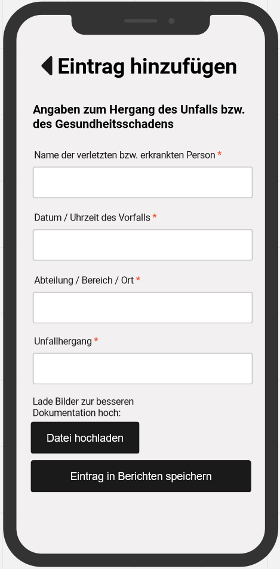
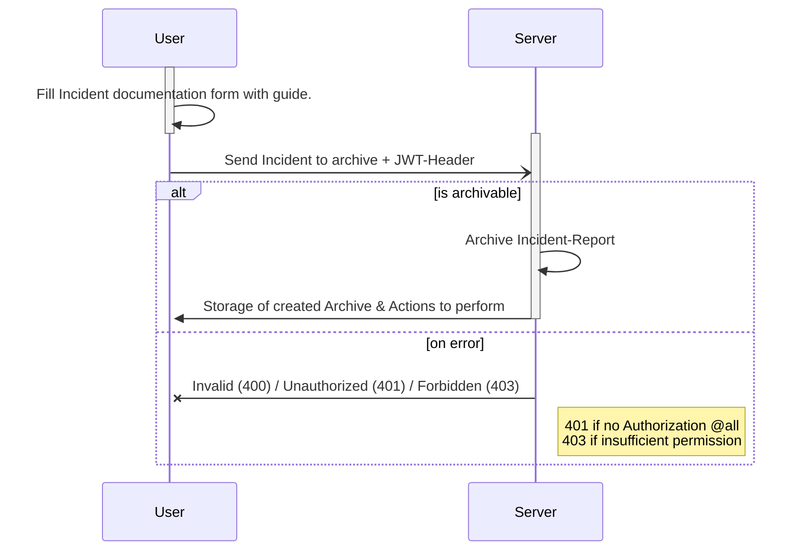

# Use-Case Spezifikation: Ereignis Erstellen

# 1. Ereignis Erstellen

## 1.1 Kurzbeschreibung
Dieser Anwendungsfall ermöglicht es einem Benutzer, ein neues Ereignis in das Verbandbuch einzutragen.  
Ein Verbandbuch wird üblicherweise verwendet, um Unfälle oder medizinische Vorfälle zu dokumentieren.

## 1.2 Mockup

# 2. Ablauf von Events

## 2.1 Grundablauf
- Der Benutzer öffnet die Anwendung und navigiert zur Verbandbuch-Seite.
- Der Benutzer wählt die Option "Neues Ereignis erstellen". (alt. Unfallbericht anlegen)
- Das Formular zur Ereigniserfassung wird geöffnet.
- Der Benutzer trägt die relevanten Informationen ein, wie Datum, Zeit, Ort, Art des Ereignisses, Beteiligte, und Beschreibung.
- Der Benutzer bestätigt die Eingabe und speichert das Ereignis.
- Das Ereignis wird im Verbandbuch gespeichert.

## 2.2 Alternativer Ablauf
Falls der Benutzer fehlende oder ungültige Informationen eingibt,  
wird eine Fehlermeldung angezeigt und der Benutzer aufgefordert, die Informationen zu korrigieren.  

Des Weiteren ist es möglich den Arbeitsfortschritt eines Ereignisses (Unfalls) lokal zwischenzuspeichern.

## 2.3 Sequenzdiagramm

# 3. Besondere Anforderungen
Die Informationen zur Ereigniserfassung müssen sorgfältig und vollständig dokumentiert werden.

# 4. Vorbedingungen
Die Vorbedingungen für diesen Anwendungsfall sind:
1. Der Benutzer ist in der Anwendung angemeldet.
2. Der Benutzer befindet sich auf der Verbandbuch-Seite.

# 5. Nachbedingungen
Das erstellte Ereignis wird im Verbandbuch gespeichert und kann von autorisierten Benutzern eingesehen werden.

# 6. Aufwandsschätzung
Für diese Funktionalität wird ein Aufwand von 8 Punkten geschätzt.
