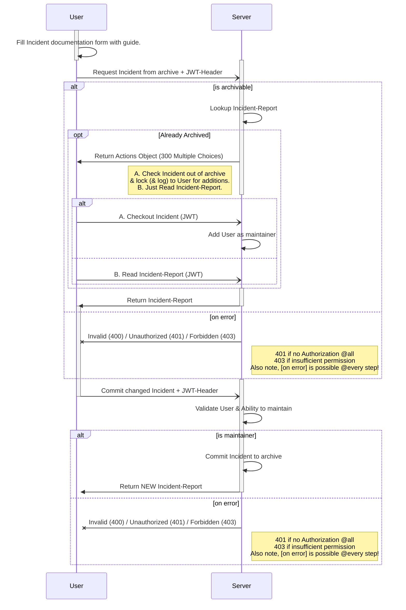

# Use-Case Spezifikation: Ereignis Bearbeiten

# 1. Ereignis Bearbeiten

## 1.1 Kurzbeschreibung
Dieser Anwendungsfall ermöglicht es einem autorisierten Benutzer, ein bestehendes Ereignis im Verbandbuch zu bearbeiten.

## 1.2 Mockup

### Work in Progress

# 2. Ablauf von Events

## 2.1 Grundablauf
- Der Benutzer öffnet die Anwendung und navigiert zur Verbandbuch-Seite.
- Der Benutzer wählt das zu bearbeitende Ereignis aus der Liste der vorhandenen Ereignisse.
- Der Benutzer öffnet das zu bearbeitende Ereignis.
- Ist das Ereignis bereits archiviert, muss dieses zunächst durch eine berechtigte Person (`rw_team`/`rw_department`/`rw_organization`/`rw_all`) freigeschalten werden.
- Das ausgewählte Ereignis wird in einem Bearbeitungsformular angezeigt.
- Der Benutzer aktualisiert die Informationen des Ereignisses, wie Datum, Zeit, Ort, Art des Ereignisses, Beteiligte und Beschreibung.
- Der Benutzer bestätigt die Aktualisierung und speichert die Änderungen.
- Das bearbeitete Ereignis wird im Verbandbuch aktualisiert.

## 2.2 Alternativer Ablauf
- Falls der Benutzer fehlende oder ungültige Informationen eingibt, wird eine Fehlermeldung angezeigt, und der Benutzer wird aufgefordert, die Informationen zu korrigieren.

## 2.3 Sequenzdiagramm

# 3. Besondere Anforderungen
Der Benutzer muss autorisiert sein, um Ereignisse bearbeiten zu dürfen. Die Informationen zur Aktualisierung müssen sorgfältig und vollständig dokumentiert werden.

# 4. Vorbedingungen
Die Vorbedingungen für diesen Anwendungsfall sind:
1. Der Benutzer ist in der Anwendung angemeldet.
2. Der Benutzer befindet sich auf der Verbandbuch-Seite.
3. Es existiert mindestens ein Ereignis, das bearbeitet werden kann.

# 5. Nachbedingungen
Die Aktualisierungen am Ereignis werden im Verbandbuch gespeichert und können von autorisierten Benutzern eingesehen werden.

# 6. Aufwandsschätzung
Für diese Funktionalität wird ein Aufwand von 10 Punkten geschätzt.
