# Software Requirements Specification v3

## Inhaltsverzeichnis
- [Software Requirements Specification v3](#software-requirements-specification-v3)
  - [Inhaltsverzeichnis](#inhaltsverzeichnis)
  - [1. Einführung](#1-einführung)
    - [1.1 Zweck](#11-zweck)
    - [1.2 Umfang](#12-umfang)
    - [1.3 Definitionen, Akronyme und Abkürzungen](#13-definitionen-akronyme-und-abkürzungen)
  - [1.4 Übersicht](#14-übersicht)
  - [2. Gesamtbeschreibung](#2-gesamtbeschreibung)
    - [2.1 Vision](#21-vision)
    - [2.2 Use Case Diagram](#22-use-case-diagram)
    - [2.3 Technologie Stack](#23-technologie-stack)
    - [2.4 Story-Points (Aufwandschätzung)](#24-story-points-aufwandschätzung)
  - [3. Architectural Goals and Constraints](#3-architectural-goals-and-constraints)
  - [4. Spezifische Anforderungen](#4-spezifische-anforderungen)
    - [4.1 Funktionalität](#41-funktionalität)
      - [4.1.1 Ein Konto erstellen](#411-ein-konto-erstellen)
      - [4.1.2 Einloggen](#412-einloggen)
      - [4.1.3 Ausloggen](#413-ausloggen)
      - [4.1.4 Erstellen eines neuen Verbandsbuch-Ereignisses](#414-erstellen-eines-neuen-verbandsbuch-ereignisses)
      - [4.1.5 Bearbeiten von Verbandsbuch-Ereignissen](#415-bearbeiten-von-verbandsbuch-ereignissen)
      - [4.1.6 Dashboard-Überblick über Verbandsbuch-Ereignisse](#416-dashboard-überblick-über-verbandsbuch-ereignisse)
      - [4.1.7 Generieren von Berichten über Verbandsbuch-Ereignisse](#417-generieren-von-berichten-über-verbandsbuch-ereignisse)
      - [4.1.8 Verwalten von Benutzerrollen und Rechten im Verbandsbuch-System](#418-verwalten-von-benutzerrollen-und-rechten-im-verbandsbuch-system)
      - [4.1.9 Erhalten von automatischen Benachrichtigungen für schwerwiegende Vorfälle](#419-erhalten-von-automatischen-benachrichtigungen-für-schwerwiegende-vorfälle)
      - [4.1.10 Erwerben eines Kontingents, um Archivierungen vorzunehmen.](#4110-erwerben-eines-kontingents-um-archivierungen-vorzunehmen)
    - [4.2 Benutzerfreundlichkeit](#42-benutzerfreundlichkeit)
      - [4.2.1 Intuitive Benutzeroberfläche](#421-intuitive-benutzeroberfläche)
    - [4.3 Hohe Verfügbarkeit](#43-hohe-verfügbarkeit)
      - [4.3.1 Kontinuierliche Erreichbarkeit](#431-kontinuierliche-erreichbarkeit)
      - [4.3.2 Datensicherheit](#432-datensicherheit)
    - [4.4 Leistung und Effizienz](#44-leistung-und-effizienz)
      - [4.4.1 Skalierbarkeit](#441-skalierbarkeit)
      - [4.4.2 Ressourcenoptimierung](#442-ressourcenoptimierung)
      - [4.4.3 Schnelligkeit und Reaktionsfähigkeit](#443-schnelligkeit-und-reaktionsfähigkeit)
    - [4.5 Qualitätskontrolle und Nutzerfeedback](#45-qualitätskontrolle-und-nutzerfeedback)
      - [4.5.1 Ständige Anwendungsoptimierung](#451-ständige-anwendungsoptimierung)
      - [4.5.2 Nutzerfeedback-Integration](#452-nutzerfeedback-integration)
    - [4.6 Ressourcen für eine reibungslose Nutzung](#46-ressourcen-für-eine-reibungslose-nutzung)
    - [4.7 Gekaufte Komponenten](#47-gekaufte-komponenten)
    - [4.8 Schnittstellen](#48-schnittstellen)
      - [4.8.1 Benutzeroberflächen](#481-benutzeroberflächen)
      - [4.8.2 Hardware-Schnittstellen](#482-hardware-schnittstellen)
      - [4.8.3 Software-Schnittstellen](#483-software-schnittstellen)
      - [4.8.4 Kommunikationsschnittstellen](#484-kommunikationsschnittstellen)
    - [4.9 Lizenzanforderungen](#49-lizenzanforderungen)
    - [4.10 Rechtliche, Urheberrechts- und andere Hinweise](#410-rechtliche-urheberrechts--und-andere-hinweise)
    - [4.11 Unterstützende Informationen](#411-unterstützende-informationen)
  - [5 Logical View](#5-logical-view)
    - [5.1 Overview](#51-overview)
    - [5.2 Architecturally Significant Design Packages](#52-architecturally-significant-design-packages)
  - [6 Process View](#6-process-view)
  - [7 Deployment View](#7-deployment-view)
  - [8 Implementation View](#8-implementation-view)
    - [8.1 Overview](#81-overview)
    - [8.2 Layer](#82-layer)
  - [9 Data View](#9-data-view)
  - [10 Size and Performance](#10-size-and-performance)
  - [11 Quality](#11-quality)

## 1. Einführung

### 1.1 Zweck
In dieser Software-Anforderungsspezifikation (SRS) werden sämtliche Anforderungen für die Applikation "IncidArch" umfassend dargelegt. Sie vermittelt eine umfassende Übersicht über das Projekt sowie dessen Vision. Zudem werden ausführliche Einblicke in die geplanten Features und die Rahmenbedingungen des Entwicklungsprozesses gewährt. Diese SRS ist ein entscheidendes Dokument, das als Leitfaden für das gesamte Projekt dient.

### 1.2 Umfang
Das Projekt wird als Android-App, iPhone-App und als Website umgesetzt.

Das Verbandsbuch-System soll folgende Hauptfunktionen bieten:

- **Ereigniserstellung und -bearbeitung**: Benutzer sollen in der Lage sein, neue Verbandsbuch-Ereignisse zu erstellen und bestehende Ereignisse zu bearbeiten. Die erstellten Ereignisse müssen je das Datum, eine Uhrzeit, einen Ort, die Art des Vorfalls und eine Beschreibung enthalten. Die Änderungen müssen im Verbandbuch sichtbar sein.

- **Dashboard-Übersicht**: Das System soll ein Dashboard bereitstellen, das eine Übersicht über alle Verbandsbuch-Ereignisse bietet. Dieses Dashboard sollte Filter- und Suchfunktionen für verschiedene Zeiträume und Kategorien umfassen. Diagramme und Grafiken zur Visualisierung von Trends und Mustern sollen ebenfalls verfügbar sein.

- **Berichterstellung**: Administratoren sollen die Möglichkeit haben, benutzerdefinierte Berichte basierend auf verschiedenen Kriterien zu generieren. Diese Berichte sollten in verschiedenen Formaten (PDF, Excel) herunterladbar sein und alle relevanten Informationen zu den Ereignissen enthalten.

- **Benutzerverwaltung und Rollenzuweisung**: Systemadministratoren sollen Benutzerrollen erstellen, bearbeiten und löschen können. Vordefinierte Rollen wie "Mitarbeiter," "Sicherheitsbeauftragter" und "Manager" sollen vorhanden sein, und Administratoren sollen individuellen Benutzern oder Benutzergruppen Rollen und Berechtigungen zuweisen können. Diese Rollen sollen die Aktionen regeln, die ein Benutzer im Verbandsbuch-System ausführen kann.

- **Benachrichtigungen**: Sicherheitsbeauftragte sollen automatische Benachrichtigungen erhalten, wenn Vorfallskategorien oder Schweregrade im Verbandsbuch erfasst werden. Diese Benachrichtigungen sollen anpassbar sein und in Echtzeit gesendet werden, um auf schwerwiegende Vorfälle schnell reagieren zu können.

### 1.3 Definitionen, Akronyme und Abkürzungen

| SRS       | Software Requirements Specification    |
| DGUV      | Deutsche Gesetzliche Unfallversicherung |
| DSGVO     | Datenschutz-Grundverordnung            |
| FAQ       | Häufig gestellte Fragen                |
| API       | Application Programming Interface     |

## 1.4 Übersicht

Die folgende Übersicht bietet eine Zusammenfassung des SRS-Dokuments und seiner Struktur. Das SRS-Dokument legt detaillierte Anforderungen für die Anwendung "IncidArch" fest und bietet Einblicke in die Projektvision, geplante Funktionen und die Rahmenbedingungen für die Entwicklung.

Das Dokument gliedert sich in die folgenden Abschnitte:

- **1. Einführung**: Dieser Abschnitt erläutert den Zweck und den Umfang des SRS-Dokuments.

- **2. Gesamtbeschreibung**: Hier finden Sie Informationen zur Vision des Projekts, ein Use-Case-Diagramm und den verwendeten Technologiestack.

- **3. Spezifische Anforderungen**: Dieser Abschnitt beschreibt ausführlich die funktionellen, benutzerfreundlichen, zuverlässigen, leistungsbezogenen, unterstützenden, designbezogenen und rechtlichen Anforderungen, welche die IncidArch-Anwendung betreffen.

- **4. Unterstützende Informationen**: Abschließend werden hier Kontaktmöglichkeiten zum IncidArch-Team und Verweise auf den IncidArch-Blog für zusätzliche Details bereitgestellt.

Das SRS-Dokument bietet eine klare Roadmap für das Projekt und informiert alle Beteiligten ausführlich über die Anforderungen und den eingesetzten Technologiestack.
    
## 2. Gesamtbeschreibung

### 2.1 Vision
Befreien Sie sich von der Last handschriftlich ausgefüllter Unfallberichte
und dem Chaos von Papierstapeln mit schwer entzifferbaren Vorfällen. 
Digitale Unfallprotokolle sind nicht nur auf dem Vormarsch – sie 
sind bereits hier und erleichtern Ihren Alltag erheblich. 
Erfüllen Sie Ihre Dokumentationspflicht nach 
DGUV § 24 Abs. 6 einfach, sicher und digital. Alle Daten werden 
nach DSGVO ausschließlich in Europa verarbeitet und gespeichert. 
Schluss mit dem lästigen Papierkram und herzlich willkommen zu einer 
effizienteren, modernen und rechtlich konformen Lösung.

### 2.2 Use Case Diagram

### 2.3 Technologie Stack
Der Technologie Stack den wir benutzen:

Typescript (als Basis & einzige Sprache)  
👇  
Deno (moderne TS Runtime im Backend)  
👇  
Hono WebStandard Framework  
👇  
Zod-OpenAPI (API & Validierung)  
🌐 
React Native (Frontend)  
☝️  
Expo (Frontend)  

---

Github Actions (Deployment)  
Docker (Deployment)  
GitHub (Development & PM)  

### 2.4 Story-Points (Aufwandschätzung)  

Bei der Aufwandsschätzung verwenden wir folgende Skala: 

## 3. Architectural Goals and Constraints

Da das Thema Sicherheit nicht zuletzt wegen der DSGVO ein akutes Thema ist,  
setzen wir bei der Entwicklung auf Eigenentwicklung und vorerst auf Applikation-Layer-Encryption,  
sodass wir stets die Kontrolle über die Datenflüsse haben  
und nicht zu sehr auf Black-Box-Bibliotheken vertrauen müssen.  

Demnach ergeben sich hier in der Entwicklung und der Planung kleine Änderungen,  
sodass unser Datenbank-Schemata sich nach der geteilten Verschlüsselungsart richten muss (vgl. [9. Data View](#9-data-view)).  
Dem Schema ist zu entnehmen, dass wir keine Nutzerdaten im Klartext persistieren möchten,  
wodurch wir im Falle eines Integritätsbruchs keine Gefahr besteht.  

Im Sinne der Benutzbarkeit und Transparenz setzen wir zudem auf eine konsistente Dokumentation,  
sowie Best-Practices (aus dem UX-Feld und während der Entwicklung).

## 4. Spezifische Anforderungen

### 4.1 Funktionalität
In diesem Abschnitt wird die verschiedenen Anwendungsfälle und ihre Funktionalität erläutert, die im Use-Case-Diagramm dargestellt sind.
Bis Dezember planen wir die Implementierung von:
- 4.1.1 Ein Konto erstellen
- 4.1.2 Einloggen
- 4.1.3 Ausloggen
- 4.1.4 Erstellen eines neuen Verbandsbuch-Ereignisses
- 4.1.5 Bearbeiten von Verbandsbuch-Ereignissen

Bis Juni möchten wir implementieren:
- 4.1.6 Dashboard-Überblick über Verbandsbuch-Ereignisse
- 4.1.7 Generieren von Berichten über Verbandsbuch-Ereignisse
- 4.1.8 Verwalten von Benutzerrollen und Rechten im Verbandsbuch-System
- 4.1.9 Erhalten von automatischen Benachrichtigungen für schwerwiegende Vorfälle

#### 4.1.1 Ein Konto erstellen
Diese Funktion ermöglicht es Benutzern, ein neues Konto im Verbandsbuch-System zu erstellen. Benutzer können ihre persönlichen Informationen angeben, um ein Konto zu registrieren. Nach erfolgreicher Registrierung werden sie in der Lage sein, sich im System anzumelden und auf die Funktionen zuzugreifen.

[Ein Konto erstellen](./use_cases/UC1_Konto_Erstellen.md)

#### 4.1.2 Einloggen
Die Einloggen-Funktion ermöglicht es Benutzern, sich in ihr Verbandsbuch-Konto anzumelden. Benutzer müssen ihre Anmeldeinformationen eingeben, um auf die Funktionen des Systems zuzugreifen. Nach dem erfolgreichen Login können sie auf ihre Verbandsbuch-Ereignisse und andere relevante Informationen zugreifen.

[Einloggen](./use_cases/UC2_Einloggen.md)

#### 4.1.3 Ausloggen
Die Ausloggen-Funktion ermöglicht es Benutzern, sich sicher aus ihrem Verbandsbuch-Konto abzumelden. Dies ist wichtig, um die Sicherheit und Privatsphäre der Benutzer zu gewährleisten. Nach dem Ausloggen haben Benutzer keinen Zugriff auf ihr Konto, es sei denn, sie melden sich erneut an.

[Ausloggen](./use_cases/UC3_Ausloggen.md)

#### 4.1.4 Erstellen eines neuen Verbandsbuch-Ereignisses
Diese Funktion ermöglicht Benutzern, ein neues Verbandsbuch-Ereignis zu erstellen. Benutzer können Daten wie Datum, Uhrzeit, Ort, Art des Vorfalls und eine Beschreibung des Vorfalls eingeben. Nach dem Erstellen des Ereignisses wird es im Verbandsbuch sichtbar sein.

[Erstellen eines neuen Verbandsbuch-Ereignisses](./use_cases/UC4_Ereigniss_Erstellen.md)

#### 4.1.5 Bearbeiten von Verbandsbuch-Ereignissen
Die Funktion "Bearbeiten von Verbandsbuch-Ereignissen" ermöglicht es Benutzern, bestehende Ereignisse im Verbandsbuch zu bearbeiten. Sie können Daten wie Datum, Uhrzeit, Ort, Art des Vorfalls und die Beschreibung des Vorfalls aktualisieren. Die vorgenommenen Änderungen werden im Verbandsbuch gespeichert.

[Bearbeiten von Verbandsbuch-Ereignissen](./use_cases/UC5_Ereigniss_Bearbeiten.md)

#### 4.1.6 Dashboard-Überblick über Verbandsbuch-Ereignisse
Diese Funktion bietet den Benutzern einen zentralen Dashboard-Überblick über alle Verbandsbuch-Ereignisse. Das Dashboard enthält Filter- und Suchfunktionen, um Ereignisse für verschiedene Zeiträume und Kategorien anzuzeigen. Darüber hinaus können Diagramme und Grafiken zur Visualisierung von Trends und Mustern angezeigt werden.

[Dashboard-Überblick über Verbandsbuch-Ereignisse](./use_cases/UC6_Dashboard.md)

#### 4.1.7 Generieren von Berichten über Verbandsbuch-Ereignisse
Benutzer mit Administratorrechten können Berichte über Verbandsbuch-Ereignisse generieren. Diese Berichte können anhand von verschiedenen Kriterien, wie Datum oder Art des Vorfalls, erstellt werden. Die Berichte können in verschiedenen Formaten (PDF, Excel) heruntergeladen werden und enthalten umfassende Informationen zu den Ereignissen.

[Generieren von Berichten über Verbandsbuch-Ereignisse](./use_cases/UC7_Berichte_Generieren.md)

#### 4.1.8 Verwalten von Benutzerrollen und Rechten im Verbandsbuch-System
Diese Funktion ermöglicht es Systemadministratoren, Benutzerrollen zu erstellen, zu bearbeiten und zu löschen. Es gibt vordefinierte Rollen wie "Mitarbeiter," "Sicherheitsbeauftragter" und "Manager," die unterschiedliche Rechte haben. Administratoren können individuellen Benutzern oder Benutzergruppen Rollen und Berechtigungen zuweisen. Rollen bestimmen, welche Aktionen ein Benutzer im Verbandsbuch-System ausführen kann, wie das Erstellen, Bearbeiten oder Löschen von Ereignissen.

[Verwalten von Benutzerrollen und Rechten im Verbandsbuch-System](./use_cases/UC8_Verwalten_Benutzerrollen.md)

#### 4.1.9 Erhalten von automatischen Benachrichtigungen für schwerwiegende Vorfälle
Sicherheitsbeauftragte können automatische Benachrichtigungen erhalten, wenn schwerwiegende Vorfälle im Verbandsbuch registriert werden. Diese Benachrichtigungen enthalten wichtige Details wie den Zeitpunkt des Vorfalls, die Art des Vorfalls und den Standort. Die Benachrichtigungen sind anpassbar, sodass der Sicherheitsbeauftragte die Kategorien festlegen kann, für die er Benachrichtigungen erhalten möchte. Die Benachrichtigungen werden in Echtzeit gesendet, um eine schnelle Reaktion auf schwerwiegende Vorfälle zu ermöglichen. Der Sicherheitsbeauftragte kann die Benachrichtigungseinstellungen nach Bedarf ändern.

[Erhalten von automatischen Benachrichtigungen für schwerwiegende Vorfälle](./use_cases/UC9_Benachrichtigungen.md)

#### 4.1.10 Erwerben eines Kontingents, um Archivierungen vorzunehmen.
Da wir eine SaaS-Anwendung anstreben, ist ein Bezahlvorgang von Nöten,
um die Archivierungs-Kosten zu decken (von bswp. S3-Storage). 
Der Bezahlvorgang beschreibt dabei den Use-Case,  
in dem der Benutzer ein Archivierungs-Kontingent erwirbt,
um später Vorfälle archivieren zu können.

[Erhalten von automatischen Benachrichtigungen für schwerwiegende Vorfälle](./use_cases/UC10_Bezahlvorgang.md)

### 4.2 Benutzerfreundlichkeit

#### 4.2.1 Intuitive Benutzeroberfläche
Unsere oberste Priorität besteht darin, eine Benutzeroberfläche zu schaffen, die auf Anhieb verständlich und leicht zu bedienen ist. Unser Ziel ist es, dass Benutzer die App ohne aufwendige Schulungen nutzen können.

### 4.3 Hohe Verfügbarkeit

#### 4.3.1 Kontinuierliche Erreichbarkeit
Wir setzen alles daran, sicherzustellen, dass die IncidArch-Anwendung rund um die Uhr verfügbar ist. Hierbei setzen wir auf innovative Technologien, permanente Systemüberwachung, clevere Caching-Strategien und eine zuverlässige Fehlerbehandlung, um sicherzustellen, dass Benutzer jederzeit auf die App zugreifen können, ohne Unterbrechungen befürchten zu müssen.

#### 4.3.2 Datensicherheit
Ein essenzielles Ziel ist es, sicherzustellen, dass keinerlei Daten verloren gehen. Dies ist von entscheidender Bedeutung, um die Integrität der erfassten Informationen zu gewährleisten. Unser System wird robuste Backup- und Wiederherstellungsmechanismen implementieren, um die Sicherheit und Verfügbarkeit der Daten zu gewährleisten.

### 4.4 Leistung und Effizienz

#### 4.4.1 Skalierbarkeit
Unsere Plattform wird darauf ausgelegt sein, mühelos mit steigender Nutzerzahl mitzuwachsen. Das System soll in der Lage sein, Anfragen von Tausenden von Nutzern gleichzeitig zu verarbeiten.

#### 4.4.2 Ressourcenoptimierung
Wir optimieren die Nutzung vom Speicher, um den Speicherbedarf unserer Anwendung zu minimieren.

#### 4.4.3 Schnelligkeit und Reaktionsfähigkeit
Wir halten die Reaktionszeit der App auf Anfragen so kurz wie möglich, um ein optimales Nutzererlebnis sicherzustellen.

### 4.5 Qualitätskontrolle und Nutzerfeedback

#### 4.5.1 Ständige Anwendungsoptimierung
Unser Team wird kontinuierlich daran arbeiten, die Anwendung zu optimieren und sicherzustellen, dass sie den höchsten Qualitätsstandards entspricht. Wir werden regelmäßig Leistungsüberprüfungen und Qualitätstests durchführen, um mögliche Engpässe oder Verbesserungsmöglichkeiten zu identifizieren.

#### 4.5.2 Nutzerfeedback-Integration
Wir schätzen das Feedback unserer Benutzer sehr. Um sicherzustellen, dass die Anwendung ihren Anforderungen entspricht, werden wir aktiv auf das Feedback unserer Benutzer hören und gezielte Verbesserungen basierend auf deren Bedenken und Anregungen umsetzen.

### 4.6 Ressourcen für eine reibungslose Nutzung

Unsere App wird mit einer umfangreichen Wissensdatenbank ausgestattet sein, um sicherzustellen, dass die Benutzer schnell und einfach Antworten auf ihre Fragen finden können. Wir werden Tutorials, Anleitungen und Tipps bereitstellen, um die Benutzer bei der effizienten Nutzung der Anwendung zu unterstützen und häufig auftretende Probleme zu lösen.

### 4.7 Gekaufte Komponenten
Wir haben derzeit keine gekauften Komponenten. Wenn in Zukunft gekaufte Komponenten vorhanden sind, werden wir sie hier auflisten.

### 4.8 Schnittstellen

#### 4.8.1 Benutzeroberflächen

Die zu implementierenden Benutzeroberflächen sind:

1. **Anmeldungsseite**: Die Seite, auf der Benutzer sich in ihrem Verbandsbuch-Konto anmelden können, indem sie ihre Anmeldeinformationen eingeben.

2. **Registrierungsseite**: Die Seite, auf der Benutzer ein neues Konto erstellen können, indem sie persönliche Informationen eingeben.

4. **Haupt-Dashboard**: Ein Dashboard, das einen Überblick über alle Verbandsbuch-Ereignisse bietet. Dieses Dashboard enthält Filter- und Suchfunktionen sowie Diagramme zur Visualisierung von Trends.

4. **Seite zur Ereigniserstellung**: Eine Seite, auf der Benutzer neue Verbandsbuch-Ereignisse erstellen können, indem sie Datum, Uhrzeit, Ort, Art des Vorfalls und eine Beschreibung eingeben.

5. **Seite zur Bearbeitung von Ereignissen**: Eine Seite, auf der Benutzer bestehende Verbandsbuch-Ereignisse bearbeiten können, um Informationen zu aktualisieren.

6. **Berichterstellungsoberfläche**: Eine Oberfläche, auf der Administratoren benutzerdefinierte Berichte über Verbandsbuch-Ereignisse generieren können.

7. **Benutzerverwaltungsseite**: Eine Seite, auf der Systemadministratoren Benutzerrollen und Berechtigungen verwalten können.

8. **Benachrichtigungseinstellungsseite**: Eine Seite, auf der Sicherheitsbeauftragte Benachrichtigungseinstellungen anpassen können, um Benachrichtigungen für schwerwiegende Vorfälle zu konfigurieren.

#### 4.8.2 Hardware-Schnittstellen

Sind clientseitig entsprechend der React Native Dokumentation zu verwenden.  

#### 4.8.3 Software-Schnittstellen

Werden in der impliziten OpenAPI-Spezifikation des Backends vorgegeben
und sind über den API-Endpoint des Backends `/doc` abgerufen _(eq. `http://example.com/api/v1/doc`)_.

#### 4.8.4 Kommunikationsschnittstellen

Es wird hauptsächlich das Hyper-Text-Transfer-Protocol (HTTP) verwendet,  
um die Backend <-> Frontend-Kommunikation zu ermöglichen.  
Standardmäßig werden wir REST/JSON verwenden  
und da Hono zudem das Remote-Procedure-Call-Protokoll (RPC) ermöglicht,  
bietet sich eine weitere alternative in einem (noch) kompakteren Datenformat als JSON an,  
zumal wir primär mit JSON arbeiten werden.

### 4.9 Lizenzanforderungen

Wir verwenden ausschließlich FOSS unter freien Lizenzen,  
wie der MIT-Lizenz.

### 4.10 Rechtliche, Urheberrechts- und andere Hinweise

Unsere Ausarbeitungen sind zunächst unserem, individuellen Urheberrecht nach geschützt,  
solange wir uns nicht im Konsens auf eine Lizenzänderung geeinigt haben.

### 4.11 Unterstützende Informationen
Für weitere Informationen können Sie das IncidArch Team kontaktieren oder unseren [IncidArch Blog](https://dh-karlsruhe.github.io/IncidArch-Blog/) überprüfen.
Die Teammitglieder sind:
- Felix Blank
- Nick Obreiter
- Alexander Geier
- Cristiano Gomes

## 5 Logical View

### 5.1 Overview

### 5.2 Architecturally Significant Design Packages

## 6 Process View

TODO

## 7 Deployment View

## 8 Implementation View

TODO

### 8.1 Overview

### 8.2 Layer

## 9 Data View

Das vorläufige ER-Diagramm für unsere verschlüsselte/private Persistierung:

```mermaid

erDiagram
    %% # Tables
    %% "🏦🔒" Has to be locked by some sort of key.
    %% "🃏🔑": Application Key - provided @runtime

    User {
        string uuid "🗝️PK"
        %% auth
        string emailHash "#hashed for initial identification"
        string email "🃏🔑 (to decrypt @runtime)"
        string salt "## RandomString ##"
        string password "#Hashed(clr_pw + salt)"
        %% personal information
        string first_name "🏦🔒"
        string last_name "🏦🔒"
        enum gender "<Optional> (🏦🔒)" 
        date birthday "<Optional> (🏦🔒)"
        string emergency_number "🏦🔒"
        bool locked "for new Authenticated Requests"
    }

    Incident {
        %% on User alteration this guy gets a new intermediate key
        %% and all the dependencies have to be updated..
        %% Change should only be commitable as full change object!
        number incident_id "🗝️PK"
        %%string intermed_key "🔓FK  (?!)"
        %% would allow adding new valid obj creation for everyone!
        %%  => possibly encrypt it alongside intermediate_key_access?
        blob encoded_incident "🏦🔒"
    }
    
    EncodedIncident {
        object IncidentDocument
    }

    OrganizationUserRole {
        uuid user_id "🔓FK"
        number organization_id "🔓FK"
        enum application_permission  "🃏🔑: r_team|rw_team|r_department|rw_department|r_organization|rw_organization|r_all|rw_all"
    }
    
    Organization {
        number organization_id "🗝️PK"
        uuid owner "🔓FK"
        number organization_key_file "Public-Key-Set (! Should not be exposed.)"
        number fallback_key "🔓FK"
        string name
        enum corporate_type
        boolean lock "If set freezes all operations on organization."
    }
    
    Metadata {
        %% Startdatum für statistische Auswertung
        date start_of_probing
        string jwt_secret "API-Integrity"
        string general_key "General-Public-Key (Fallback, etc.)"
        string application_key "🃏🔑 Encrypts backend_processable @runtime"
    }

%%    IntermediateKeystore {
%%        number d "🔓FK"
%%        number fallback_key "🔓FK"
%%    }

    UserKeystore {
        number key_id "🗝️PK"
        uuid user "🔓FK"
        string key_file "Public-Key-Set"
    }

    UserIncidentKey {
        %% could also describe role of user in incident for organization
        %% althoug thats versioned inside the IncidentDocument
        uuid vault_owner "🔓FK"
        number incident_id "🔓FK"
        string my_intermediate_key_access "Incident decrypting key"
    }

    OrganizationIncidentKey {
        %% could also describe role of user in incident for organization
        %% althoug thats versioned inside the IncidentDocument
        uuid vault_owning_organization "🔓FK"
        number incident_id "🔓FK"
        string orga_intermediate_key_access "Incident decrypting key"
    }

    FallbackKeystore {
        %% Row Storage to prevent attackers from concluding priv-keys
        %% yet practically you can regenerate
        number fallback_key
        string priv_key_file "Encoded with General-Key"
    }

    FallbackRestoration {
        number fallback_key "🔓FK"
        datetime used_at
        number organization_id "🔓FK"
    }

    %% 
    %% # Relations
    %% 
    %% Witness is being recorded..
    %% Person is recorder on zero or more incidents. (or no recorder @all)

    %% make zero imposible & use dummy for 'no permissions'/'bare person'
    Incident ||--|| EncodedIncident: "contains"
    %%Incident ||--|| UserKeystore: "intermediary secures"
    User ||--|| Organization : "owns with 'rw_all'"
    User }|--|| OrganizationUserRole : "is part of"
    Organization ||--|{ OrganizationUserRole : "is part of" 

    UserKeystore }|--|| User : "identifies"

    Metadata ||--|{ Organization : "is within"

    FallbackKeystore ||--o| Organization : "secures on fallback"

    %% Intermediary Keys
    OrganizationIncidentKey ||--|| Incident : "secures"
    OrganizationIncidentKey }|--|| Organization : "holds"

    UserIncidentKey }|--|| Incident : "allows for de-/en-cryption"
    UserIncidentKey }|--|| User : "holds"

    %% should log restorations
    %% restiration is opt-out.
    FallbackRestoration }|--|| FallbackKeystore : "logs usage off"
    FallbackRestoration }|--o| Organization : "rescues organization key"

    %% Statistics
    Statistics {
        number organization_id
        blob ongoing_encoded_statistics
        %% could be normalized into chunks of encoded statistics,
        %% althoug some form of procedural statistics would be great.
    }

    EncodedStatistics {

    }

    Statistics ||--|| Organization : "produces and evaluates"
    Statistics ||--|| EncodedStatistics : "stores securly"
```

## 10 Size and Performance

## 11 Quality

TODO: Architekturtaktik